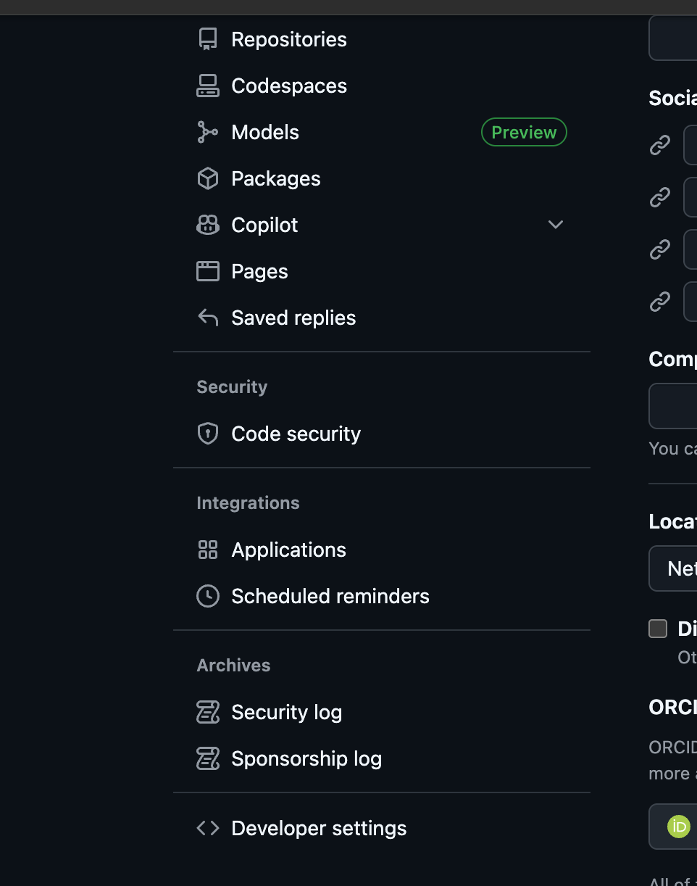
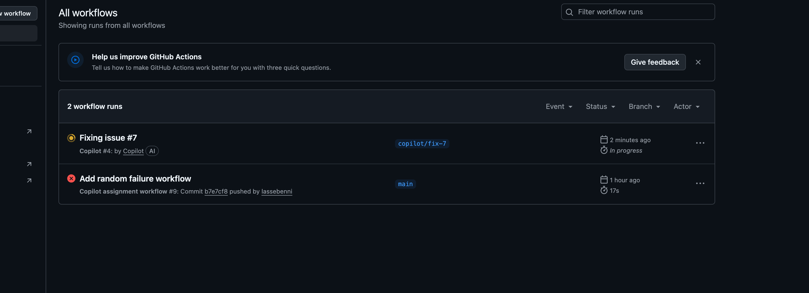
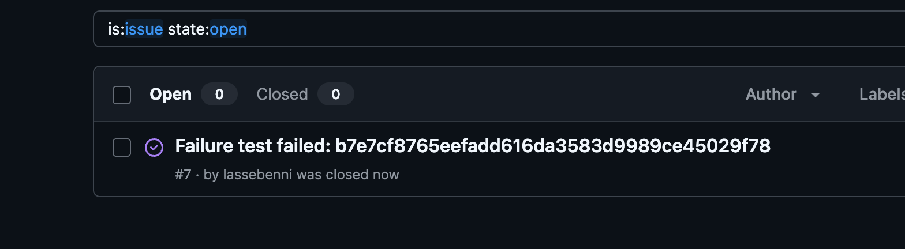

**TLDR:** In this blog, we'll show you how to **automate GitHub Actions failure handling** using **GitHub Copilot's coding agent** to create issues and fix broken builds automatically.

## See It In Action First

Here's what the complete workflow looks like when your CI fails:

> 🔒 **Security First:** This workflow gives AI access to your repository. We'll configure it to only access selected repos and disable data collection. [See full security details](#security-considerations).

**The result:** Your CI fails at 9 AM, Copilot creates a fix by 9:05 AM, you review and merge from your phone during your coffee break.

## What we will implement

• When your CI fails, a workflow automatically creates a detailed issue with failure context and assigns it to **Copilot's coding agent**.

• **Copilot analyzes the failure** and creates a pull request with a proposed fix, often resolving common issues like dependency updates, linting errors, and configuration problems.

• You can **review and merge fixes from anywhere** using GitHub Mobile, turning dead time into productive debugging sessions.

• Setup takes **5 minutes** and requires GitHub Copilot Pro ($10/month with 30-day free trial) and basic repository configuration.

## Why This Actually Matters

**Before:** CI fails → You manually create an issue → It sits in your backlog → Someone eventually reads the workflow logs → Replicates the issue locally → Debugs and fixes

**After:** CI fails → Issue created automatically with context → Copilot analyzes the failure → Suggests a fix or starting point → Quick review and merge

The difference? Your build failures get addressed automatically when they occur, saving you precious debugging time.

## Mobile-First Workflow

Another key benefit is using the [GitHub Mobile](https://github.com/mobile) app on the go. You can review and merge Copilot's pull requests from anywhere, turning dead time into productive debugging sessions.

## What You'll Need

**Required:**
- GitHub Copilot Pro subscription ($10/month, [30-day free trial](https://github.com/github-copilot/pro))
- A GitHub repository with Actions workflows

**That's it.** We'll walk through enabling the features and creating the necessary tokens in the setup steps below.

> **New to Copilot?** Check if you're eligible for [free access](https://docs.github.com/en/copilot/how-tos/manage-your-account/get-free-access-to-copilot-pro) or learn about all [GitHub Copilot plans](https://docs.github.com/en/copilot/get-started/plans).

## Setup (5 minutes)

**1. Enable GitHub Copilot Features**

First, ensure you have [GitHub Copilot enabled](https://github.com/settings/copilot/features) for your account.

Next, enable the GitHub Copilot coding agent feature. This allows the coding agent to work on issues and create pull requests automatically.

Finally, configure repository access. **Choose "Only selected repositories"** to limit the coding agent's access to only the repos where you want this automation.

> **Security tip:** Never choose "All repositories" - this gives AI access to everything. Select only the repos where you want automated fixes.

**2. Create Access Token**

Go to GitHub **Developer Settings** to create a Personal Access Token.

> **Why do we need this?** GitHub's standard workflow permissions can't assign issues to Copilot (since it's an AI, not a regular user). We need a special token that gives our workflow permission to create issues and assign them to the Copilot bot.

Create a new **fine-grained Personal Access Token** with these permissions:
- **Read and Write access to Issues**
- **Read access to Repository**

Store the resulting token (starts with `github_pat_...`) - we'll add it to repository secrets next.

**3. Configure Repository Secrets**

Navigate to your repository's **Settings > Secrets and variables > Actions**.

Click "New repository secret" and add:
- **Name:** `COPILOT_ASSIGN_PAT`
- **Value:** Your token from step 2

**4. Add the Workflow**

Create `.github/workflows/copilot-create-issue.yml` in your repository. Copy the complete workflow code from [the example repository](https://github.com/lassebenni/gh-auto-issues/blob/main/.github/workflows/copilot-create-issue.yml).

The workflow automatically:
1. Detects when your main workflow fails
2. Creates an issue with failure context
3. Assigns it to Copilot using the GraphQL API
4. Copilot analyzes and creates a fix PR

**5. Test It Works**

Test your setup before waiting for a real failure:

1. Add a failing step to any workflow: `run: exit 1`
2. Push to your repository
3. Watch the workflow fail and automatically create an issue
4. View the proposed fix in the PR created by Copilot, especially take a look at the Copilot Session in the PR comments, which contains thinking process and rationale behind the fix.
5. Merge the PR (issue closes automatically), and (hopefully) watch the workflow succeed. In case of failure, a new issue will be created.

2. Push to trigger the workflow
3. Watch it fail and automatically create an issue
4. Check that Copilot gets assigned and starts working
5. Remove the failing step once confirmed working

## How It Works (The Magic)

Once your setup is complete, here's the automated flow when your build fails:

**When Your Build Fails...**

Your GitHub Actions workflow fails (happens to the best of us).

The failure trigger activates your issue creation workflow, which creates a detailed issue with:
- Workflow name and run number
- Failure timestamp and logs
- Link to the failed run
- Error context for debugging

**Copilot Takes Action...**

Since the issue was automatically assigned to Copilot, the AI immediately begins analyzing the failure:

Copilot analyzes your codebase and the specific failure context, then creates a pull request with a proposed fix.

You can chat with Copilot in the PR to understand the problem better or request changes to the approach.

**Review and Merge...**

The pull request gets updated with Copilot's proposed fix.

You review the changes to make sure they look reasonable.

Mark the PR as ready for review.

Approve and merge the fix.

The original issue automatically closes. Done!

## When Copilot Can't Fix It

Sometimes Copilot's fix won't work or will miss the mark. That's normal! Here's what to do:

**If the fix is close but not quite right:**
- Comment in the PR and tag `@copilot` with specific feedback
- Ask for adjustments: "This fix works but breaks test X, can you also update the test?"
- Copilot can iterate on its approach based on your guidance

**If the fix is completely wrong:**
- Close the PR and fix it manually
- The original issue stays open for you to handle
- Consider if the failure logs gave enough context

**Remember:** The goal isn't perfection—it's turning "forgotten broken builds" into "tracked issues with starting points."

## Best Practices

- **Always review before merging** - Copilot is smart but not infallible
- **Use descriptive commit messages** - They help Copilot understand context
- **Start with non-critical repos** - Test the workflow on side projects first
- **Set up notifications** - Know when auto-issues are created
- **Works best for:** dependency updates, linting errors, simple test failures, config issues

## What's Next?

This automation works particularly well for common failure patterns. For complex bugs, you'll still need human intervention, but this handles the tedious stuff automatically.

The best part? Once it's set up, you literally never think about it again. Your CI failures just... get addressed automatically.

## Security Considerations

> **In context:** While these security considerations are important, they shouldn't prevent you from using this automation on appropriate repositories. The goal is informed usage, not avoidance.

With "auto-collaboration," you're giving the Copilot coding agent scoped, write-level interaction with your repo. Here are the key privacy risks and how to manage them:

## Essential Settings (Configure These First)

**For individual Copilot Pro users:**

1. **Restrict repository access:** GitHub → Your Copilot → Coding agent → set to "Only selected repositories" (not all repos)
2. **Disable data collection:** GitHub → Your Copilot → turn OFF "Allow GitHub to use my code snippets for product improvements"
3. **Block external models:** GitHub → Your Copilot → AI models → set Claude/Gemini to "Disabled" and keep Bing/web search disabled
4. **Verify training is OFF:** GitHub → Your Copilot → Model training → should be OFF by default for Pro plans

## When to Use This Workflow

**Good candidates:**
- Open source projects
- Internal tools and development environments
- Projects with good test coverage and non-sensitive code

**Avoid for:**
- Repositories with embedded secrets or sensitive business logic
- Production-critical systems without human oversight
- Compliance-regulated codebases

## Key Risks to Understand

- **Repository access:** The coding agent can read your entire repo and propose changes via PRs (limited to `copilot/*` branches)
- **Workflow context:** Failed workflows might expose sensitive information in logs that get included in auto-created issues
- **Telemetry:** Prompts and suggestions may be collected unless disabled in settings

## Enterprise Users

Organizations have additional controls:
- **Content exclusion:** Prevent Copilot from seeing specific paths (e.g., `/secrets/**`, `/config/**`)
- **Organization policies:** Manage settings centrally in Settings → Copilot
- **Training:** Business/Enterprise plans don't use your code for training by default

## Quick Security Checklist

- [ ] Coding agent limited to selected repos only
- [ ] Data collection/telemetry disabled
- [ ] Alternative models (Claude/Gemini) disabled
- [ ] Repository secrets properly configured (never commit PATs)
- [ ] Content exclusion rules set up (if enterprise)

For complete details, see GitHub's [official Copilot documentation](https://docs.github.com/en/copilot/how-tos/manage-your-account/manage-policies).

## Ready to Never Miss a Build Failure Again?

**Try it:**
1. Set up the workflow on a test repository first
2. Trigger a test failure to see it in action
3. Roll it out to your main projects once comfortable

**Share it:**
- If this saves you time, share it with your team
- Star the [example repository](https://github.com/lassebenni/gh-auto-issues) if it's useful

**Improve it:**
- Found a better approach? [Open an issue](https://github.com/lassebenni/gh-auto-issues/issues)
- Have ideas for extending this? I'd love to hear them

**Next up:**

GitHub meters the usage of Copilot through [Actions minutes and Coilot premium requests](https://docs.github.com/en/copilot/concepts/coding-agent/coding-agent#copilot-coding-agent-usage-costs). Currently each coding agent Session (basically all iterations within a single Pull Request) counts as 1 premium request. In a future blog I will dive deeper into this usage model and what you should watch out for, since I am also still learning it myself.

In the [Pro plan you get 300 Premium requests per month](https://docs.github.com/en/copilot/get-started/plans#comparing-copilot-plans) and can buy additional ones for a small charge. However these are shared between VSCode and Copilot on Github.com, since all calls to "Premium" models such as Claude Sonnet 4 (which I prefer currently) count as premium request (and [some are multipliers](https://docs.github.com/en/copilot/concepts/billing/copilot-requests#model-multipliers)). So you will need to be aware of this when setting up the coding agent in your repositories.

Thanks for reading!

---