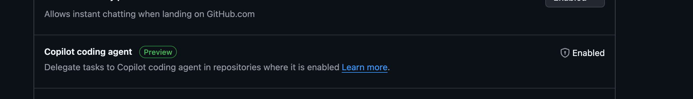
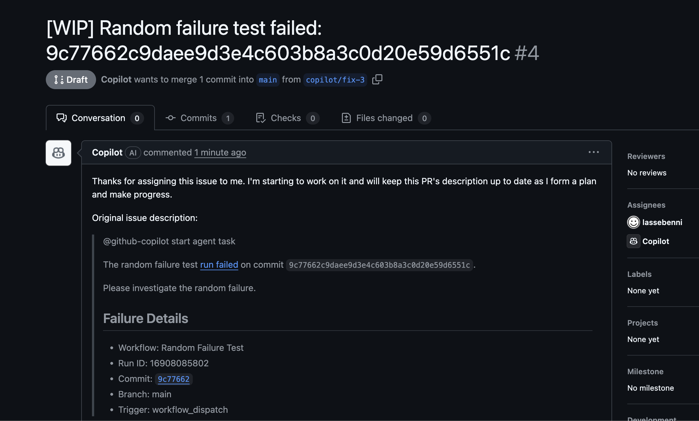
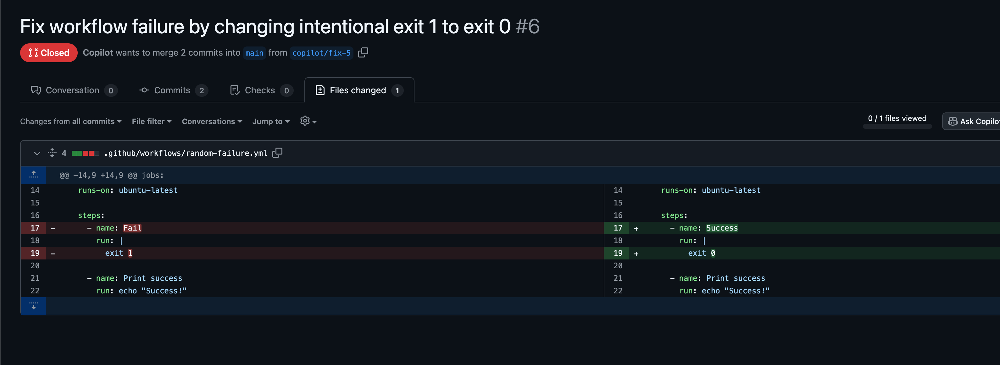

> This requires a paid [GitHub Copilot Pro license](https://docs.github.com/en/copilot/get-started/plans) (30 day free trial or $10/month). If your organization has Copilot Pro, it might be available to you already.

**TLDR:** Add an `on-failure` step to your GitHub Workflow that uses the GitHub GraphQL API to create a new [Issue](https://docs.github.com/en/issues/tracking-your-work-with-issues/about-issues) on failure and assign [GitHub's Copilot coding agent](https://docs.github.com/en/copilot/how-tos/use-copilot-agents/coding-agent/assign-copilot-to-an-issue?versionId=free-pro-team%40latest&page=queries#assigning-an-issue-to-copilot-via-the-github-api) to it (currently in *Public Preview*). This creates a PR and starts a coding agent session where Copilot reads the logs and creates a potential fix. You can then review the PR, iterate on the solution, or merge the changes. [See workflow code](.github/workflows/copilot-create-issue.yml).

**Assumption:** You maintain one or more GitHub Actions workflows, and whenever a scheduled workflow fails, you're faced with manually creating an *Issue*, reading the error logs, and tracking down the root cause. Sound familiar?

GitHub Copilot's [coding agent](https://github.blog/news-insights/product-news/github-copilot-meet-the-new-coding-agent/) offers a better approach. You can automate the entire process of dealing with failed workflows: when your GitHub Actions fail, you can automatically create an Issue and let Copilot fix it for you. In the best case it immediately suggests the correct fix. In many cases, it will give you a reasonable first try which you can iterate on. In any case: no more manual issue creation, no more forgotten build failures!

## Why This Actually Matters
**Before:** CI fails → You manually create an issue → It sits in your backlog → Someone eventually reads the workflow logs → Replicates the issue locally → Debugs and fixes

**After:** CI fails → Issue created automatically with context → Copilot analyzes the failure → Suggests a fix or starting point → Quick review and merge

The difference? Your build failures get addressed automatically when they occur, saving you precious debugging time.

## Merge PRs on the go
Another key benefit is to be able to use the [GitHub Mobile](https://github.com/mobile) app on the go, allowing you to review the pull requests from anywhere and stay updated on the issue's progress. For me, this is a gamechanger for my personal projects, as I can now quickly review and merge PRs while commuting or during downtime.

Here's how to set it up.

## What You'll Need

- A GitHub account (free). You can register one from [github.com](https://github.com).
- A **GitHub Copilot Pro/Business/Enterprise subscription** (required for the coding agent feature). You can:
  - Sign up for [GitHub Copilot Pro](https://github.com/github-copilot/pro) at $10/month with a 30-day free trial. You can sign up for the trial with a credit card/Paypal and immediately cancel it, still retaining the use of Copilot until the end of the trial period.
  - Check if you're eligible for [free access to Copilot Pro](https://docs.github.com/en/copilot/how-tos/manage-your-account/get-free-access-to-copilot-pro)
  - Learn more about all [GitHub Copilot plans](https://docs.github.com/en/copilot/get-started/plans)
  - GitHub Pro also includes [advanced features](https://docs.github.com/en/copilot/get-started/plans#github-copilot-pro) like priority support and more customization options.
- A GitHub repository, create one [here](https://github.com/new).
- Enable GitHub Copilot in your account. This allows Microsoft's AI to work on issues and create pull requests automatically.
- A GitHub Actions workflow. You can copy the code from [.github/workflows/copilot-create-issue.yml](.github/workflows/copilot-create-issue.yml)

## Setup Steps

Before we can assign issues to Copilot, you need to make sure GitHub Copilot is properly enabled and configured for your repository.

## Step 1: Enable GitHub Copilot

First, ensure you have [GitHub Copilot enabled](https://github.com/settings/copilot/features) for your account. This is the top-level permissions that will enable Copilot to work.

## Step 2: Enable the Coding Agent

Next, enable the GitHub Copilot coding agent feature. This allows the coding agent to work on issues and create pull requests automatically.

## Step 3: Allow the Coding Agent Access

Finally, make sure to allow the coding agent to work on the repositories you specify. This permission is required for Copilot to create and update pull requests on your behalf. In this case, I chose to allow for select repositories instead of all, in order to filter its access. 

> *You could also enable the "Automatic Copilot code review" option so each Pull Request gets automatically reviewed by Copilot, but it is not necessary for the auto-issue creation workflow.*

## Step 4: Create a Personal Access Token

Go to your GitHub **Developer Settings**. You need a fine-grained PAT specifically for the Copilot coding agent, since the default `GITHUB_TOKEN` used in the GitHub Actions workflow does not have the necessary permissions to create issues assigned to Copilot. Name the token `COPILOT_ASSIGN_PAT` (this is the name I chose, but you can name it whatever you want as long as you are consistent).

Create a new **fine-grained Personal Access Token** with these permissions:
- **Read and Write access to Issues**
- **Read access to Repository**

Store the resulting token, which starts with `github_pat_...`. We will need to store it in our repository secrets in the next step.

> You can't create fine-grained PATs via CLI. Has to be done in the UI. At least at the moment of writing, August 2025.

## Step 5: Configure Repository Secrets

Navigate to your repository's Settings > Secrets and variables > Actions to configure the secrets needed for the Actions workflow.

Click "New repository secret" to add the personal access token you generated in step 4.

Name the secret `COPILOT_ASSIGN_PAT` and paste the token as the value. This secret is crucial because the workflow needs to authenticate with GitHub's GraphQL API to create issues and assign them directly to the Copilot agent.

> **Why do we need a PAT?** GitHub's REST API doesn't currently support assigning issues to Copilot since it's not a traditional collaborator. Our workflow uses the GraphQL API instead, which requires authentication via a Personal Access Token. [Learn more](https://docs.github.com/en/copilot/how-tos/use-copilot-agents/coding-agent/assign-copilot-to-an-issue?versionId=free-pro-team%40latest&page=queries).

## Step 6: Add the Workflow File

Create the GitHub Actions workflow file at `.github/workflows/copilot-create-issue.yml`. You can copy the complete workflow code from [the repository](.github/workflows/copilot-create-issue.yml).

The workflow uses the `COPILOT_ASSIGN_PAT` secret (which contains the PAT token we created in Step 4) to authenticate with GitHub's GraphQL API and, in case of failure of the main Workflow, creates an Issue and assigns it to the Copilot coding agent.

**Technical Note:** The GraphQL steps:
1. Queries for the Copilot bot ID using the repository's `suggestedActors`
2. Creates the issue with the Copilot agent pre-assigned using the `createIssue` mutation
3. Uses your PAT token for authentication to perform these operations

## Step 7: Test Your Setup

Before waiting for a real failure, test your workflow by intentionally triggering a failure:

1. Modify your workflow to include a step that will fail (like `run: exit 1`)
2. Push to your repository
3. Watch the workflow fail and automatically create an issue
4. View the proposed fix in the PR created by Copilot, especially take a look at the Copilot Session in the PR comments, which contains thinking process and rationale behind the fix.
5. Merge the PR (issue closes automatically), and (hopefully) watch the workflow succeed. In case of failure, a new issue will be created.

## Step 8: How the Automation Works

Once your setup is complete, here's what happens when your build fails:

Your GitHub Actions workflow fails (happens to the best of us).

The `on: failure` trigger activates your issue creation workflow.

A new GitHub issue is automatically created with:
- Workflow name and run number
- Failure timestamp  
- Link to the failed run
- Error context

The issue appears in your Issues tab, ready for action.

## Step 9: Copilot Takes Action

Since the issue was automatically assigned to Copilot in the previous step, the AI immediately begins analyzing the failure:

Copilot analyzes the failure and creates a pull request to fix it.

The AI examines your codebase and the specific failure context.

You can chat with Copilot about the issue to understand the problem better.

Copilot proposes specific code changes to resolve the workflow failure.

## Step 10: Review and Merge

The rest follows standard GitHub flow:

The pull request gets updated with Copilot's proposed fix.

You review the changes to make sure they look reasonable.

Mark the PR as ready for review.

Get approval from your team (or approve it yourself if you're feeling brave).

Merge the fix.

The original issue automatically closes. Done.

## Pro Tips

- **Don't skip the review step.** Copilot is smart, but it's not infallible. Don't blindly merge PRs without checking the changes. Sometimes it gets sidetracked. If you create a comment in the PR and tag @copilot, you can make it iterate on your suggestions to hopefully get things right the second time, or third..
- **Customize your issue templates** to include more context about failures.
- **Set up notifications** so you know when new auto-issues are created.
- **Use this for tests, not just builds.** Failed tests often have obvious fixes that Copilot can handle.

The best part? Once it's set up, you literally never think about it again. Your CI failures just... get fixed automatically.

*This works particularly well for common failure patterns: dependency updates, linting errors, simple test failures, and configuration issues. For complex bugs, you'll still need human intervention, but this handles the tedious stuff.*

## Who am I?

I'm Lasse, a Data & Analytics Engineer with 7+ years of experience building data platforms and automation pipelines across AWS, GCP, and Azure. I've worked with companies like KLM Royal Dutch Airlines, Vattenfall, and Felyx, where I've architected and implemented scalable data solutions using everything from managing cloud infrastructure with Terraform to building data warehouses with Snowflake and dbt.

I believe building robust CI/CD pipelines and automation solutions is essential for streamlining development, reducing debugging time, and saving costs for clients. This GitHub Actions workflow was born out of the need to automate issue tracking for build failures, ensuring problems are detected and addressed quickly with AI-powered suggestions.

You can find more of my work on [GitHub](https://github.com/lassebenni) or connect with me on [LinkedIn](https://www.linkedin.com/in/lasse-benninga-a462b194/).
