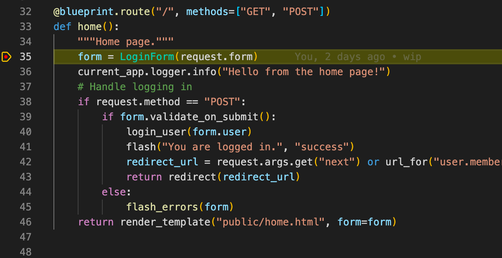
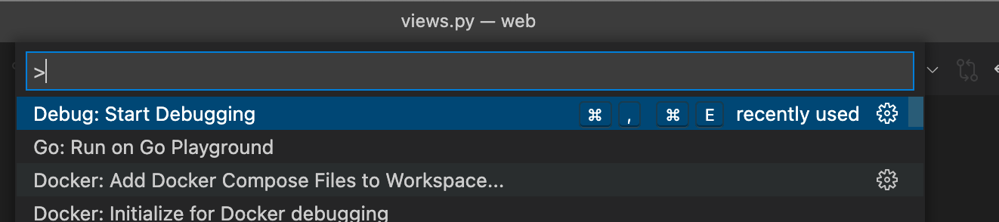
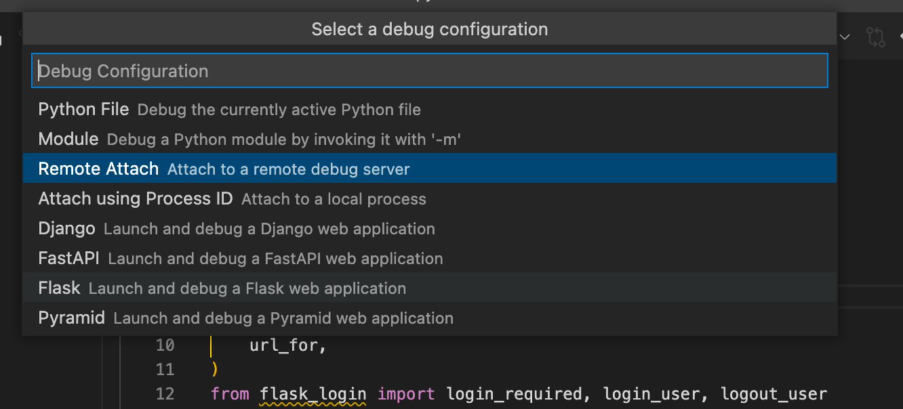
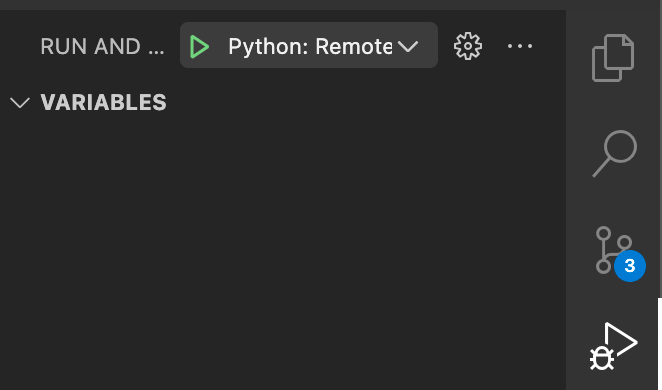
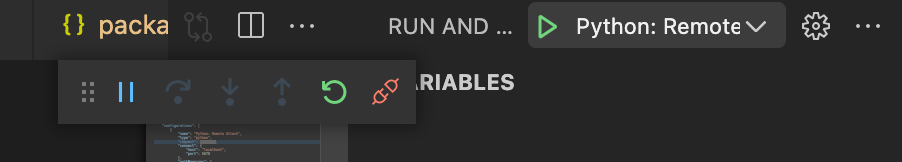
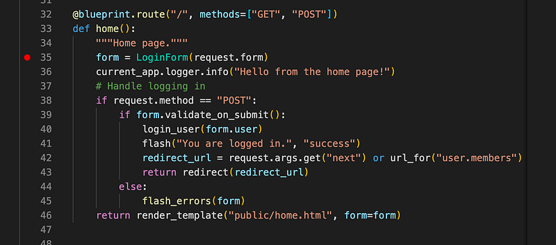
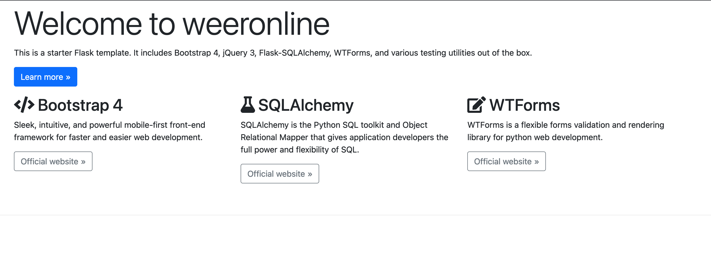

**TLDR:** Install `debugpy` and run the `debugpy` in your `package.json`. Then launch "Python: Remote Attach" in VS Code.



I assume you are here because you cloned a Flask python application and you want to debug it in Visual Studio Code. You tried fooling around in `launch.json` with the "Python: Flask" app. Perhaps with the `Docker: add Dockerfiles to workspace...` command. Who knows what you tried, the VS Code docs can be confusing. The point is, it didn't work and now you are here. I'll spare you the words, here's the code.

## Prerequisites

- You have a Flask application opened in VS Code (and you want to debug it).
- Your Flask app is similar to the Cookiecutter Flask application (See [https://github.com/jamescurtin/demo-cookiecutter-flask](https://github.com/jamescurtin/demo-cookiecutter-flask)), which uses `node`. This means there's a `package.json` that contains commands like `start` to run the app (webpack + flask).
- You have a `Dockerfile` that creates an environment to run the Flask app in.
- You have `docker-compose.yml` to build & run the `Dockerfile`.
- There's a `app.py` that starts your Flask app.

## Step 1: Install debugpy in Dockerfile

We'll want to use [debugpy](https://github.com/microsoft/debugpy#debugging-a-module). It's a nifty debugger for Python that can debug a file/module (among other) and wait until a Listener (VS Code) has attached itself to the debug proces.

Find your Dockerfile and add a step to install `debugpy`.

```dockerfile
# Dockerfile
...
RUN pip install debugpy
...

CMD [ "npm", "start"]
```

## Step 2: Start Flask via debugpy

In my case, there's an elaborate `package.json` that runs all kinds of `node` commands and also starts `flask`. We have to force the app to start with `debugpy` before starting flask.

```json
# package.json
"scripts": {
    "start": "python -m debugpy --wait-for-client --listen 0.0.0.0:5678 -m flask run --host=0.0.0.0"
},
```

- Make sure that your app starts with `python -m debugpy`.
- The `--wait-for-client` command forces the command to wait until a listener is actually attached.
- The `--listen 0.0.0.0:5678` starts the debug listener on port 5678 (default Python debugger port) on `localhost.`
- The `flask run --host=0.0.0.0` was my default command, perhaps you have a more elaborate one, so modify it as you see fit.

## Step 3: Add Python Remote Attach

1. Open a `.py` file in your project. Now open the [Command Palette](https://code.visualstudio.com/docs/getstarted/userinterface#_command-palette) and run "Debug: Start Debugging".



2. Choose "Remote Attach"



3. Choose `localhost` and `5678` as host and port.

4. The following file should be created in `.vscode/launch.json`:

```json
# launch.json
{
    // Use IntelliSense to learn about possible attributes.
    // Hover to view descriptions of existing attributes.
    // For more information, visit: https://go.microsoft.com/fwlink/?linkid=830387
    "version": "0.2.0",
    "configurations": [
        {
            "name": "Python: Remote Attach",
            "type": "python",
            "request": "attach",
            "connect": {
                "host": "localhost",
                "port": 5678
            },
            "pathMappings": [
                {
                    "localRoot": "${workspaceFolder}",
                    "remoteRoot": "."
                }
            ]
        }
    ]
}
```

Almost done.

## Step 4: Expose port 5678 in docker-compose

Everything is ready, except for exposing the debug port from inside the container to the host (your computer). Open the docker-compose file and expose the port

```yaml
# docker-compose.yml
services:
  flask-dev:
    build:
      context: .
      target: development
    image: "web-development"
    ports:
      - "5000:5000"
      - "2992:2992"
      - "5678:5678"
```

Done. Let's start the container and debugger.

## Step 5: Start containers and debugger

1. Build the docker-compose file to run your changes:

```bash
docker-compose build 
...
[+] Building 2.0s (23/59)                                                     
 => [web-development internal] load build definition from Dockerfile     0.0s
 => => transferring dockerfile: 1.76kB                                   0.0s
 => [web-manage internal] load build definition from Dockerfile          ...
```

2. Run the containers:

```bash
docker-compose up flask-dev
...
Attaching to flask-dev_1
flask-dev_1  | 
flask-dev_1  | > web@1.0.0 start
flask-dev_1  | > run-script-os
flask-dev_1  | 
flask-dev_1  | 
flask-dev_1  | > web@1.0.0 start:default
flask-dev_1  | > concurrently -n "WEBPACK,FLASK" -c "bgBlue.bold,bgMagenta.bold" "npm run webpack-watch" "npm run flask-server"
flask-dev_1  | 
flask-dev_1  | [WEBPACK] 
flask-dev_1  | [WEBPACK] > web@1.0.0 webpack-watch
flask-dev_1  | [WEBPACK] > run-script-os
flask-dev_1  | [WEBPACK] 
flask-dev_1  | [FLASK] 
flask-dev_1  | [FLASK] > web@1.0.0 flask-server
flask-dev_1  | [FLASK] > python -m debugpy --wait-for-client --listen 0.0.0.0:5678 -m flask run --host=0.0.0.0
...
```

- In my case the container is called `flask-dev` in the `docker-compose.yml`. It might be something different for you. Change accordingly.

3. Attach VS Code to the debugger

Now that the container is up and running, it will be patiently waiting until something connects to the `5678` port before it will actually run `flask`.

Go to the "Run and Debug" view in VS Code and start the "Python: Remote Attach" configuration:



4. It should connect to the debugger:



## Step 6: Set a breakpoint and debug

1. Set a breakpoint in your `views.py` (or another routing file), e.g. like I did on line 35 for my `/` route which will be triggered on loading the homepage.



2. Open the homepage in your browser, for me it's [http://localhost:5000](http://localhost:5000)/



3. Checkout the debugger, paused at the breakpoint!


*That sweet, sweet, yellow line.*

Enjoy the debugging.

**Fin.**
