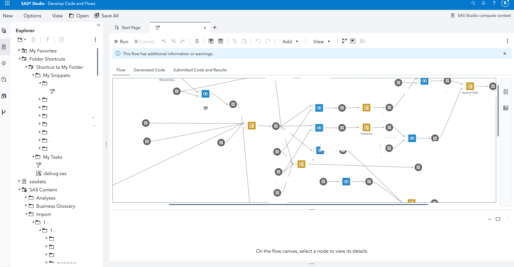
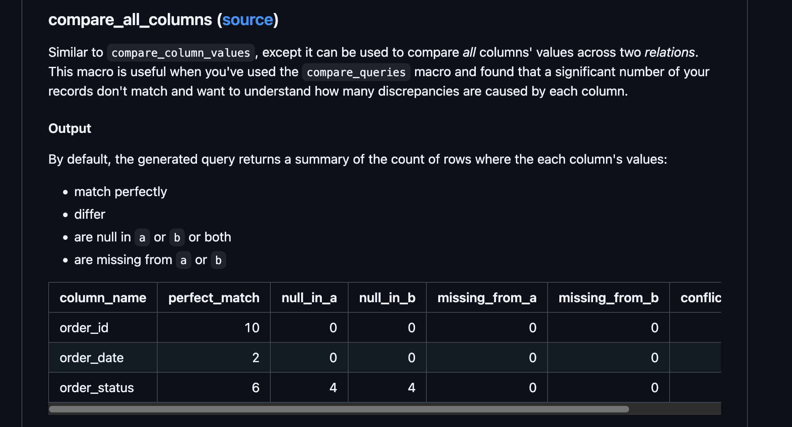
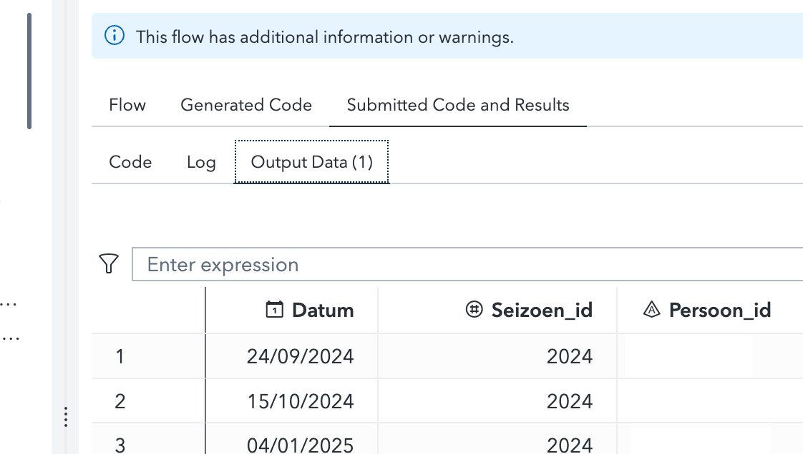
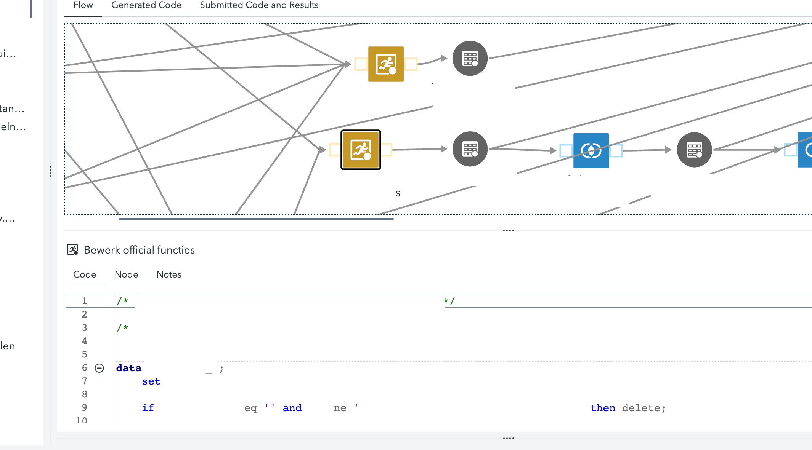
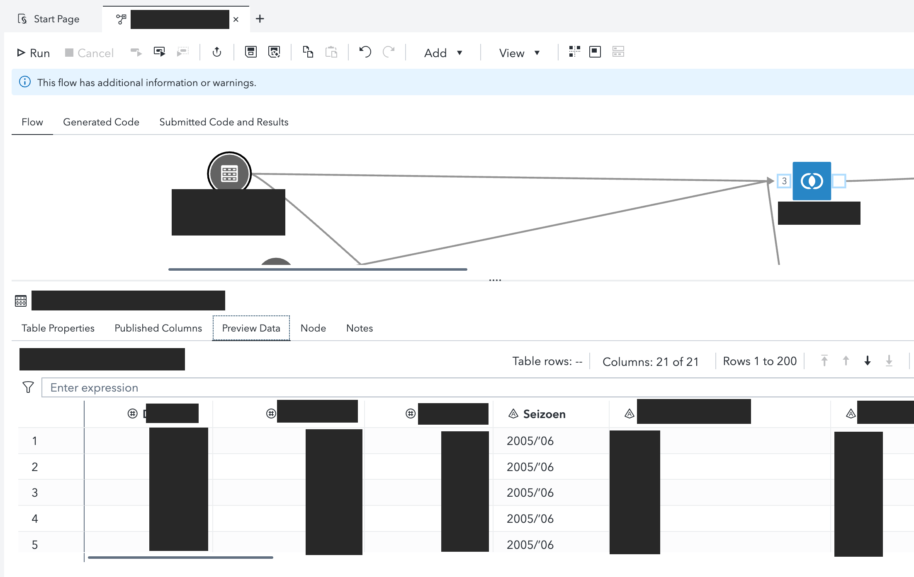
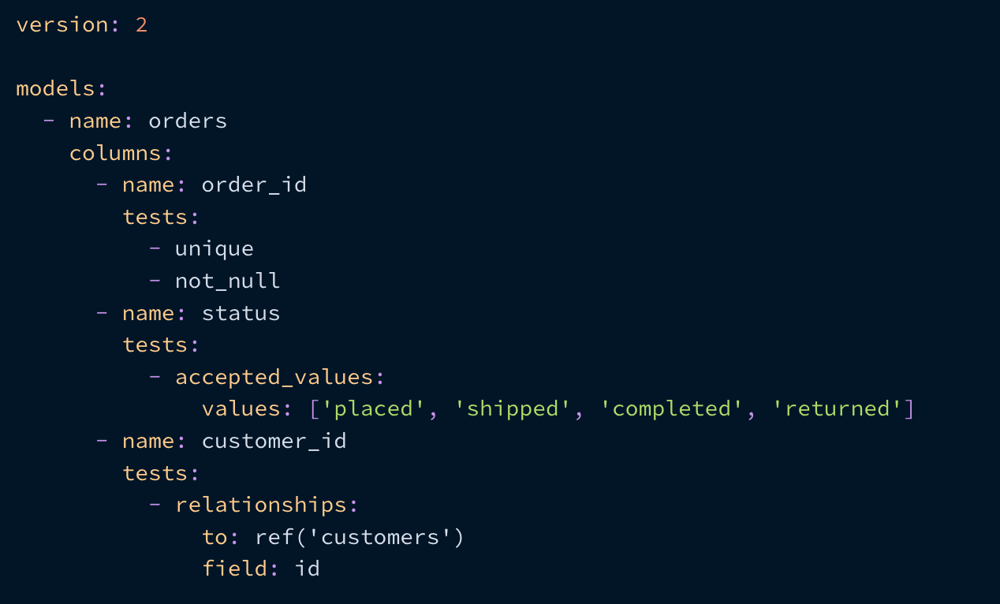
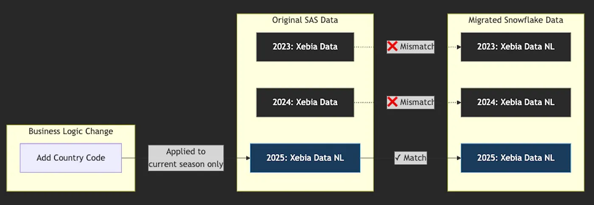

**TLDR:**

In this blog, we'll share key insights from our recent project migrating a sports sector client from **SAS Viya** to **Snowflake** and **dbt**, focusing on *practical tips* to make your migration smoother.

• Snowflake and dbt offer a powerful combination of modern analytics due to their **support** for **version control for SQL code**, **automated testing**, and **documentation**.

• We discuss practical tips such as using the [dbt-audit-helper](https://github.com/dbt-labs/dbt-audit-helper) package for **comparing migrated tables**, the **challenges of lift-and-shift vs remodeling**, and the **intricacies of incremental flows**.

## A bit of background

A client of ours in the sports sector had been relying on [SAS Viya](https://www.sas.com/en_us/software/viya.html) as their primary analytics platform for several years. The platform housed more than 50 analytical flows that had been built up over multiple years, representing significant business logic and institutional knowledge. These flows were important for the organization's decision-making processes and downstream reporting.

## Challenges with SAS Viya

As the client's business grew, their SAS Viya platform struggled to keep pace with evolving needs. Key limitations became increasingly apparent:

• Lack of robust version control for analytics code
• No tiered deployment across multiple environments
• Limited automated testing capabilities
• Difficulties in scaling to accommodate growing data volumes

**These** limitations are common pain points for many organizations as they scale. Although SAS Viya is a platform that offers a range of features for visualization, data lineage, and support for multiple programming languages, today's data teams can expect more sophisticated development practices to be able to scale and maintain their analytics workloads.

## dbt and Snowflake for modern data teams

Alright, so what alternatives are there for data teams wanting more development control? Well, if you're already familiar with Xebia Data, you could say we [really like dbt](https://xebia.com/blog/?q=dbt). For those of you unfamiliar with the tool (or rather *platform* if we're talking about the managed offering), [dbt](https://docs.getdbt.com/docs/introduction) is a product by **dbt Labs** that started out as an open-source Python package. It's essentially a framework to write SQL in a more sane and modular way, which was very useful to analysts navigating through a mess of individual SQL files. Over the years [it has grown](https://www.getdbt.com/product/dbt-cloud) into a fully-fledged platform. But today, we'll focus on the open-source package, [dbt-core](https://github.com/dbt-labs/dbt-core), which many data teams use today.

What we like about dbt is how it provides a [SQL-first approach](https://docs.getdbt.com/docs/build/sql-models) to building data analytics pipelines, with [version control](https://docs.getdbt.com/docs/collaborate/git-version-control), [testing](https://docs.getdbt.com/docs/build/data-tests), and [documentation](https://docs.getdbt.com/docs/build/documentation) out of the box. We like how dbt is available as both a [production-ready open-source package](https://github.com/dbt-labs/dbt-core) that your team can start exploring right away, and as a [managed cloud platform](https://docs.getdbt.com/docs/cloud/about-cloud/dbt-cloud-features) for teams that want to outsource parts of the complexity of modern software development. We position it as our central data transformation tool when we deploy our custom [Xebia Data platform offering](https://solutions.xebia.com/solutions/cloud-data-platform) at clients. We also provide in-house training and support for dbt Labs' customers. Last year we were even named [EMEA Services Partner of the year](https://www.linkedin.com/posts/xebia_xebia-recognized-as-a-2024-emea-services-activity-7285906229229494273-F18K/). So although we might be a bit biased, we like to think it's with good reason. 😉

dbt connects to a [plethora of data platforms](https://docs.getdbt.com/docs/trusted-adapters), so it's not tied to a specific data platform. In this case, the client had already picked [Snowflake](https://www.snowflake.com/) as their data platform. A popular choice, since it's a [fully-managed data warehouse](https://www.snowflake.com/en/why-snowflake/) that's [highly scalable](https://docs.snowflake.com/en/user-guide/warehouses-overview) and offers [top-tier data analytics capabilities](https://www.snowflake.com/en/product/analytics/), alongside robust [access control](https://docs.snowflake.com/en/user-guide/security-access-control-privileges). We're not biased (well, maybe some of us are) but we do like Snowflake for these reasons. So not a bad choice. [Combined with the previously stated features of dbt](https://www.getdbt.com/data-platforms/snowflake), this was a solid choice for our client.

## Data development capabilities comparison

| Task | SAS Viya | dbt + Snowflake |
|------|----------|-----------------|
| **Version Control** | ❌ Limited, often manual processes | ✅ Native Git integration with branch management and CI/CD capabilities |
| **Testing** | ❌ Manual validation, custom scripts required | ✅ Built-in data quality tests (uniqueness, not-null, relationships, custom SQL) |
| **Documentation** | ❌ Often separate from code, manual maintenance | ✅ Self-documenting models with integrated documentation that updates with code |
| **Visualizations** | ✅ Robust built-in dashboarding and visualization capabilities | ❌️ Limited native visualization options; typically requires separate BI tools |

## The Migration

The solution was to migrate the fundamental workloads to Snowflake, paired with dbt (data build tool) for transformations. This combination would provide the scalability and modern development features needed, while allowing the client to retain SAS Viya for downstream analysis and reporting, where the team was comfortable.

Our team of two analytics engineers and a supporting data engineer embarked on a six-month migration journey, after which we would transition the remaining work to the client's internal team. The significant differences between SAS Viya's approach and SQL-based platforms like Snowflake required careful planning and execution.

## Key Learnings and Tips

So finally here are the key learnings and tips we have collected after 6 months of migration:

## Tip 1: Lift-and-Shift vs. Remodeling

Migrating data workloads involves a critical decision: should you lift-and-shift existing models and logic as-is, or seize the opportunity to redesign the data model from the ground up?

[Lift-and-shift](https://www.reddit.com/r/sysadmin/comments/sziblp/why_is_called_liftandshift/) is the term used for moving a system to a new platform without changing the underlying code. In a data migration, this means trying to keep the original data model and business logic as much as possible. However, we often see that data models become more chaotic and complex over time, making them hard to maintain and debug. Often, no single individual is to blame for this since the data models are typically the result of a team's collective work over time and complexity build-up. For data migrations, a lift-and-shift can be a quick win, but it can also be a source of hidden issues that can be difficult to debug.

A "remodeling" approach offers the chance to implement more maintainable designs like the [Dimensional Model popularized by Ralph Kimball](https://en.wikipedia.org/wiki/Dimensional_modeling). Due to its (relative) simplicity, it is popular with analysts and business users alike. You can read more on the [Dimensional Model in Tais' blog](https://xebia.com/blog/kimball-dimensional-modelling/) or the [dbt implementation](https://docs.getdbt.com/blog/kimball-dimensional-model). It is a solid strategy that we have implemented countless times for our clients, and will continue to implement for the foreseeable future.

However, remodeling introduces its own challenges:

**Challenge 1: Domain knowledge requirements**

Effective remodeling requires a deep understanding of the business domain. Migration developers may lack this knowledge, slowing progress. Modeling is not easy since it combines experience, domain knowledge, and gut feeling. In our case, we were modeling sports data in the data warehouse. Some of the questions we would discuss were: "Should player statistics be modeled at the game level or aggregated seasonally? Or maybe both? And what about handling a player's team affiliation? Should they be handled as slowly changing dimensions to track when players are traded? Or what about storing referee decisions as part of a match, or rather track them as separate facts? The decisions we made relied heavily on conversations with the analysts using the data, where we tried to balance simplicity of the datamodel with covering edge-cases. Never an easy task.

**Challenge 2: Data quality issues**

Remodeling often reveals data quality problems that may require domain expertise to resolve. For a "lift-and-shift," we can assume that the data, regardless of quality, should simply be moved from old to new. But in the "remodel" approach, we're actively building a new, some might even say "better" model. But what if the foundations have data quality issues? Addressing these issues often requires domain knowledge, which the migrating developers might not have, and necessitates input from the client's in-house experts.

**Challenge 3: Scope creep**

Once remodeling begins, stakeholders may request additional features: "Since you're changing table X, could you add feature Y?" This is a common request, but it's not always possible to add new features to an existing model. You'll need to decide whether to incorporate the new feature into the existing model or create a separate one.



The image above shows how complex SAS flows can become over time, making them challenging to maintain and migrate without careful planning.

## Tip 2: Implement Table Comparison Tools

When migrating business logic from SAS to Snowflake, validation is crucial. Comparing tables with millions of rows manually is impractical and error-prone. Using a "eyes-only" approach simply does not cut it for tables with millions of rows and multiple columns.

We found the [dbt-audit-helper](https://github.com/dbt-labs/dbt-audit-helper) package invaluable for this task. Its compare_all_columns macro helps identify differences between the original SAS tables and our newly created dbt models. We especially found this macro incredibly helpful — with it you can point the macro at two tables (or dbt models) and see where they differ.



Our approach was to:
1. Copy the original SAS table to Snowflake
2. Create the equivalent dbt model in Snowflake
3. Use the comparison tool to identify and resolve discrepancies

We even customized the `compare_all_columns` macro to make it a bit easier to understand, although in the meantime the macro has also been updated in the package and seems quite intuitive.

Another option worth exploring is [dbt-data-diff](https://github.com/infinitelambda/dbt-data-diff), specifically designed for Snowflake and dbt users and created by a data consultancy called [infinitelambda](https://infinitelambda.com/). Although for us, we found the `dbt-audit-helper` to be more than enough.

Without a comparison tool, you will have to manually check the tables and compare the results. This is a time-consuming process and can be error-prone. A comparison tool can help you with this task and save you a lot of time.

## Tip 3: Debug Complex SAS Flows with Variables

A common challenge in SAS flows is variable overwriting. In many flows, we encountered code patterns where the same variable was reassigned multiple times:

```sql
/* Example of problematic SAS code with variable overwriting */
DATA results;
  /* First calculation */
  SET input_table;
  revenue = sales * price;
RUN;

DATA results;
  /* Second calculation overwrites previous results */
  SET results;
  profit = revenue - cost;
RUN;

DATA results;
  /* Third calculation overwrites again */
  SET results;
  margin = profit / revenue;
RUN;
```

This coding style, while functional, can make debugging difficult because intermediate results are overwritten. For SAS flows, there is no breakpoint debugging, so intermediate results are lost and only the end-result is available. To troubleshoot these flows, you must run the entire process and examine the execution output.



Our solution was to create a copy of the flow in a development folder and modify the code to preserve intermediate tables:

```sql
/* Improved SAS code with unique variable names */
DATA results_step1;
  /* First calculation preserved */
  SET input_table;
  revenue = sales * price;
RUN;

DATA results_step2;
  /* Second calculation builds on previous without overwriting */
  SET results_step1;
  profit = revenue - cost;
RUN;

DATA results_final;
  /* Final calculation with all intermediates preserved */
  SET results_step2;
  margin = profit / revenue;
RUN;
```

## Tip 4: Mixing SQL and SAS Logic in the SAS Flows

One of the most challenging aspects of the migration was dealing with flows that combined SQL with SAS-specific logic. Instead of only SQL logic, which is easier to port to Snowflake and dbt, the SAS language can also be used for doing things that are not possible or very hard in SQL such as:

- Looping over datasets with `DO` loops
- Performing window functions with `LAG` in the SAS language
- Custom code nodes with SAS-specific syntax

This does increase the complexity of the SAS flows and migration since this logic has to be refactored into plain SQL or enhanced with dbt's Jinja logic.



**Solution:** Take a step back and examine the intent of the SAS logic. Is it possible to achieve the same result using just SQL? Instead of simply porting the logic, we might be able to achieve the same result with a different approach.

## Tip 5: Untangling SAS Flow Dependencies

In SAS, flows can depend on each other. For instance, *Flow A* can create an output table, which *Flow B* reads as an input. In fact, the output table created by *Flow A* could have any number of downstream dependencies, including dashboards.

This requires careful consideration. Once you replace a SAS flow with a dbt model but the output tables are not the same, this could break the downstream flows or dashboards. Luckily, SAS Viya offers a tool to track these dependencies.

**Solution:** Use SAS' powerful Lineage feature to understand the dependencies between flows. In the lineage overview, you can search for different datasets and flows and see the upstream (before) and downstream (after) dependencies.


## Tip 6: Get Familiar with the SAS Preview Filtering

Often when debugging differences between the dbt model and the original SAS flow, you will want to open up the flow and run parts of it to figure out why records are different. You can do this by using the preview functionality in SAS. In here you can filter the records (similar to the `WHERE` clause in SQL) e.g. `season = '2025'`. Be aware though that there are some gotcha's with the types as filtering a date string has to be cast in SAS by adding 'd' to the string: `season = '2025'd`.



## Tip 7: Be Mindful of dbt Data Tests

In the SAS flows, there were no uniqueness or null tests. If you're not familiar with these, check out the [dbt documentation on data tests](https://docs.getdbt.com/docs/build/data-tests). These "data tests" validate the data in your tables. A table should [ALWAYS have a primary key](https://next.docs.getdbt.com/terms/primary-key) (which can consist of multiple columns), and that key should NEVER be null.

HOWEVER, uncovering pre-existing data quality issues can be extremely time-consuming. While adding `unique` and `not_null` tests is a best practice in dbt (and analytics engineering generally), it can significantly slow down a lift-and-shift migration. We spent considerable time discovering data quality issues in the datasets. This is normal, and testing ultimately improves your data quality. But decide upfront whether addressing these issues is within your migration scope.

When performing a "lift-and-shift" data migration, be aware that implementing dbt's `data_tests` (distinct from `unit_tests`, which are an entirely different challenge) will likely slow your progress, as failing tests will need to be addressed or deliberately ignored. Before starting, clarify your migration responsibilities: Are you expected to fix data quality issues, or should you focus solely on matching the numbers from the original system, even if they contain inconsistencies? While there's no one-size-fits-all answer, at Xebia Data we firmly believe that data quality issues are the root cause of reporting problems and should be identified, addressed, and prevented whenever possible.



## Tip 8: Handle True Deletes in Source Systems

The source data that we were working with was being delivered in weekly incremental batches, meaning that we only received the newest data from the source system. However, at some point during the migration, we discovered that a certain dataset was not making sense due to duplicate records where they shouldn't be, which broke our primary key tests in dbt.

This led us to realize that the users of the source system had actually deleted some records (also referred to as 'true deletes'). This was not a mistake, but a feature of the source system. However, since these deletions weren't being synced to us since we only received new records each week.

Here's a simplified example to illustrate the problem using sports data:

### Week 1: Initial player data in source system

| player_id | player_name       | team_name | season |
|-----------|-------------------|-----------|--------|
| 1001      | Dumky De Wilde    | Xebia FC  | 2025   |
| 1002      | Lasse Benninga    | Xebia FC  | 2025   |
| 1003      | Jovan Gligorevic  | Xebia FC  | 2025   |

### Week 1: Our data warehouse after initial load

| player_id | player_name       | team_name | season |
|-----------|-------------------|-----------|--------|
| 1001      | Dumky De Wilde    | Xebia FC  | 2025   |
| 1002      | Lasse Benninga    | Xebia FC  | 2025   |
| 1003      | Jovan Gligorevic  | Xebia FC  | 2025   |

In Week 2, Lasse Benninga transferred to another team and was removed from the Xebia FC roster in the source system. However, our incremental load process only receives new or modified records, not information about deletions.

### Week 2: Current data in the source system

| player_id | player_name       | team_name | season |
|-----------|-------------------|-----------|--------|
| 1001      | Dumky De Wilde    | Xebia FC  | 2025   |
| 1003      | Jovan Gligorevic  | Xebia FC  | 2025   |
| 1004      | Ricardo Granados  | Xebia FC  | 2025   | <- New player added

### Week 2: Incremental export we receive

| player_id | player_name       | team_name | season |
|-----------|-------------------|-----------|--------|
| 1004      | Ricardo Granados  | Xebia FC  | 2025   | <- Only new records

### Week 2: Our data warehouse after the incremental load

| player_id | player_name       | team_name | season |
|-----------|-------------------|-----------|--------|
| 1001      | Dumky De Wilde    | Xebia FC  | 2025   |
| 1002      | Lasse Benninga    | Xebia FC  | 2025   | <- Problem! Player was removed in source
| 1003      | Jovan Gligorevic  | Xebia FC  | 2025   |
| 1004      | Ricardo Granados  | Xebia FC  | 2025   |

As you can see, our data warehouse still shows Lasse Benninga on the team even though this player was removed from the source system. This causes issues when joining with other tables (like match statistics) or when running primary key tests in dbt.

### Solution: Periodic full sync of all data

If we perform a full sync instead, our data warehouse would correctly reflect the current state of the team roster:

| player_id | player_name       | team_name | season |
|-----------|-------------------|-----------|--------|
| 1001      | Dumky De Wilde    | Xebia FC  | 2025   |
| 1003      | Jovan Gligorevic  | Xebia FC  | 2025   |
| 1004      | Ricardo Granados  | Xebia FC  | 2025   |

In dbt, you can implement this by scheduling a full refresh of your incremental models regularly (e.g., weekly or monthly) to ensure your data stays in sync with the source system.

**Solution:** Request periodic full-syncs of the source data to ensure you stay updated with the source system. The lesson here is that if you're getting incremental exports from a source system that allows deletions, you need regular full syncs to handle **true deletes** properly.

## Tip 9: Consider Incremental SAS Flows Carefully

Beyond the incremental data loads, the SAS flows themselves also contained "incremental logic". Simply put, this means that when a flow executes, it doesn't read and process ALL the data in the source table, but only a subset — for example, `where season = '2025'` to read only the latest season, or `insert_date >= last_run_date` to process only records inserted since the last run.

However, similar to the incremental load, you should regularly consider **full-syncs** to deal with "business logic drift." This is a more complex topic, so an example should help.

Let's say you have a sport's team called `Xebia` that has played three seasons in a row. Now, in our new season a rule is added that a team should always have the country code added to the name (silly example, I know but stick with me here). Fine, we think. We will add it to the flow so that the country code is prepended to that name. So after running the improved flow, our team is called 'Xebia NL' instead of 'Xebia' for the `2025` season. And since we only run the flow incrementally, meaning when we execute the flow, we would load the current season's data only and overwrite this season in the output table, the previous season's team name is still 'Xebia'.

But now consider migrating this flow to Snowflake and dbt: since we will migrate the current, up-to-date business logic in the SAS flow, it will include the prepending of the country code. Then, once we compare the current season's data to that in the migrated Snowflake table it will match. But running it for the previous seasons will not, since in our new Snowflake table it will have 'Xebia NL' for each season instead of 'Xebia' like in the original SAS table. This is a problem since if we want to compare the tables, we will not be able to do so since the data will not match. 

This one is tricky, since there are multiple options and requires making a decision on the SAS side:



- **Option 1**: Run a full-sync on the SAS side. This will overwrite all the history with the *CURRENT* business logic. This might not be what you want, depending on the nature of the logic, since you are effectively erasing history. If you do this, you might want to keep a copy of the older partitions (seasons) you will be overwriting, just in case. The advantage is that you can match the Snowflake table with the SAS tables since they should now result in the same data because the business logic has been updated.
- **Option 2**: To preserve history, you should not overwrite it by running a full sync in the SAS flow. But this does mean that we cannot replicate the historical values since the business logic has been lost (and even if we could go back in the SAS changelogs, this might be a monumental task depending on the number of changes up to now). A pragmatic approach is to migrate the older partitions (seasons) to a separate Snowflake model and to UNION that with the latest dbt model (of the current season). Also, document the differences between the two so that the team is aware of these in the future. Consider running regular full syncs for the new dbt incremental model from now on (obviously without overwriting the separate historical data).

## Tip 10: Preserve History for Overwritten Data

This introduced a problem when a sports team switched to another division, and the previous division membership was overwritten during the weekly SAS flow run.

**Without dbt snapshots (regular table — only current state):**

```sql
-- Regular table only shows the current state
SELECT * FROM teams WHERE team_id = '1234';

| team_id | team_name | division_id | division_name | updated_at           |
|---------|-----------|-------------|---------------|----------------------|
| 1234    | Xebia Data| DIV_C       | Division C    | 2025-03-15 09:45:00 |
```

**With dbt snapshots (preserving history as SCD Type 2):**

```sql
-- dbt snapshot table preserves the complete history
SELECT
  team_id,
  team_name,
  division_id,
  division_name,
  updated_at,
  dbt_valid_from,
  dbt_valid_to
FROM team_division_snapshot
WHERE team_id = '1234'
ORDER BY dbt_valid_from;

| team_id | team_name | division_id | division_name | updated_at           | dbt_valid_from       | dbt_valid_to         |
|---------|-----------|-------------|---------------|----------------------|----------------------|----------------------|
| 1234    | Xebia Data| DIV_A       | Division A    | 2025-01-10 14:30:00 | 2025-01-10 14:30:00 | 2025-02-05 10:15:00 |
| 1234    | Xebia Data| DIV_B       | Division B    | 2025-02-05 10:15:00 | 2025-02-05 10:15:00 | 2025-03-15 09:45:00 |
| 1234    | Xebia Data| DIV_C       | Division C    | 2025-03-15 09:45:00 | 2025-03-15 09:45:00 | null                 |
```

**Solution:** Use dbt snapshots to preserve the history. We can store the data in these snapshots so that if the original table is overwritten, we keep the history. [Read more on snapshots here](https://docs.getdbt.com/docs/build/snapshots)

## Tip 11: Handle SAS-Specific Functions in Snowflake

Another free tip since you made it this far!

During migration, you'll likely encounter SAS-specific functions that don't have direct equivalents in Snowflake. For example, we discovered that age calculations differed slightly due to the precision differences between SAS's [yrdif](https://documentation.sas.com/doc/en/pgmsascdc/9.4_3.5/lefunctionsref/p1pmmr2dtec32an1vbsqmm3abil5.htm) function and Snowflake's [DATEDIFF](https://docs.snowflake.com/en/sql-reference/functions/datediff.html) function. This occurs because `yrdif` handles leap years with more complexity. While Snowflake offers equivalents for most SAS functions, in some cases you'll need to either write custom functions or accept minor calculation differences.

**Solution:** Document the differences between SAS and Snowflake functions, and decide with stakeholders what level of precision variance is acceptable. In our case, we accepted small differences in age calculations after confirming they wouldn't impact business decisions.

## Conclusion

Migrating from SAS Viya to Snowflake and dbt is not a silver bullet — it's a significant transformation that comes with its own set of challenges. While these modern tools offer advantages like scalability and version control, they're ultimately just that: tools.

The real foundation of successful analytics transformation isn't the technology stack but the data teams who work together daily. It's the analysts and engineers who commit to improving data quality through automated testing, who simplify complex queries rather than perpetuating them, and who take the time to document the non-intuitive aspects of your data models.

Yes, dbt and Snowflake can make these practices easier to implement, but they won't magically fix underlying issues in your data ecosystem. You will need to keep uncovering and discussing issues, one day at a time. Working in dbt just makes this more visible and easier to address.

Our migration journey taught us that success depends on people and processes as much as platforms. The teams that thrive post-migration are those that embrace collaboration, continuous improvement, and a commitment to quality — regardless of which technology they're using.

---

## Need more gear on your journey on becoming an Analytics Engineer?

Looking to deepen your Analytics Engineering knowledge? Look no further! Our team of experts has written the definitive guide: [The Fundamentals of Analytics Engineering](https://www.amazon.com/Fundamentals-Analytics-Engineering-end-end/dp/1837636451). This comprehensive resource, authored by myself and six talented co-authors, covers everything you need to know to excel as an Analytics Engineer.


