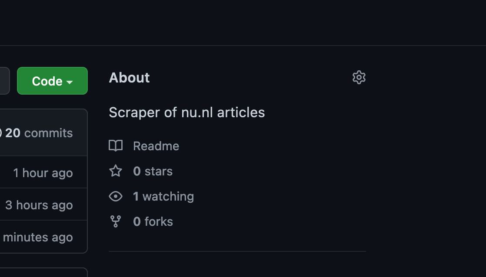

**TLDR:** Create a new Github repository and add a [Workflow](https://github.com/lassebenni/git-scraper-nu-nl/blob/main/.github/workflows/scrape.yml) file containing a `schedule` and a `curl` statement which downloads a JSON file from a API endpoint on `cron` schedule into the repository. Visualize the results using [Flat-viewer](https://flatgithub.com/lassebenni/git-scraper-nu-nl/blob/main/headlines.json?filename=headlines.json&sha=f4fc507dc611954ea5bf0de6bc9231d1081e4b02). See below for a more detailed step-by-step guide.

```yaml
on:
  push:
  workflow_dispatch:
  schedule:
    - cron:  '6,26,46 * * * *' # every twenty minutes

jobs:
  scheduled:
    runs-on: ubuntu-latest
    steps:
    - name: Check out this repo
      uses: actions/checkout@v2
    - name: Fetch latest data from the API endpoint
      run: |-
        curl -s "https://www.nu.nl/block/lean_json/articlelist?limit=20&offset=0&source=latest&filter=site" | jq '.data.context.articles' > headlines.json
    - name: Commit and push if the data has changed
      run: |-
        git config user.name "Automated"
        git config user.email "actions@users.noreply.github.com"
        git add -A
        timestamp=$(date -u)
        git commit -m "Latest data: ${timestamp}" || exit 0
        git push
```

## Intro: Git Scraping

This guide is inspired by the excellent [Simon Willison's](https://simonwillison.net/) "Git Scraping" concept https://simonwillison.net/2021/Mar/5/git-scraping/ which combines the free compute in Github Actions with storing flat-files (e.g. json) in a Git repository.

### Github Actions

For those unfamiliar with [Github Actions](https://docs.github.com/en/actions): it allows you to run code the in your Github repository on Github's computers for free (which are actually Microsoft's computers since they own Github now). When you create an account in [Github](https://github.com/) you are able to create a repository, and choose the **visibility**. As long you set the visibility to **public,** Microsoft provides unlimited minutes for the Github Action, this means that you can run scheduled webscraping for free!

> [GitHub Actions usage is free for both public repositories and self-hosted runners.](https://docs.github.com/en/billing/managing-billing-for-github-actions/about-billing-for-github-actions#about-billing-for-github-actions)

[However, there are some limits to the total runtime of the jobs within a workflow, and the workflow itself as well.](https://docs.github.com/en/actions/learn-github-actions/usage-limits-billing-and-administration#usage-limits) But it does mean that we theoretically run an unlimited amount of web scrapers in Github, as long as we keep the repository visibility **Public** (code and data accessible to the internet). If you want to hide your code, you can keep the repository **Private** but then you are bound to a limited amount of minutes of compute a month (currently 2,000 Actions minutes/month).

### Flat files in a Git repository

Nowadays, many websites use JSON ([what is JSON?](https://www.infoworld.com/article/3222851/what-is-json-a-better-format-for-data-exchange.html)) as the [default data format](https://www.programmableweb.com/news/json-clearly-king-api-data-formats-2020/research/2020/04/03). The advantage is that JSON is (fairly) readable and understandable for us humans so that we can store it in a file that we can read ourselves: a "flat-file". Another advantage is that many other software applications support JSON as an input e.g. an application creates charts based on JSON input. Now, often in modern systems, data is stored in a database, and not as a flat-file. But since we want to create a simple scraper that just downloads some JSON from a URL and stores it, a flat-file is perfect.

[Git](https://en.wikipedia.org/wiki/Git) is a popular Version Control System, which tracks files over time, and a must for any serious software developer. Github is a provider managed Git "repositories" (which are tracked projects). Normally we use a repository mainly to store versions of code in a software project, but we can also leverage it to store different versions of a flat-file which we scrape. This way, every time we scrape new data, we create a new version in the history while keeping a copy (commit) of the previous version as well. This way it's possible to easily view changes between versions which is usually not so simple in traditional databases.

### Github Action Git Scraping

This makes it possible to perform any number of actions that you would previously run on your own computer, in the cloud using Github Actions. A good use case is web scraping. And since we can often get data from API's in the form of JSON and store this file in a Github repository, it creates a very powerful opportunity for virtually free, scheduled, and tracked web scraping. In this guide I will show you how I scrape the news articles for a Dutch news website [https://www.nu.nl](https://www.nu.nl) on a schedule and store the JSON file containing the articles into the repository in [https://github.com/lassebenni/git-scraper-nu-nl](https://github.com/lassebenni/git-scraper-nu-nl).

## Steps for to follow for creating the scraper

### 1. Find something to scrape

In order to scrape and store data, we obviously need some data to begin with. Following my example, I will show how to find an API endpoint that return JSON so that we can call this in our scraper. With a bit of luck, you can replicate the steps for the data source of your own, e.g. another website that you want to track.

We will navigate to [https://www.nu.nl](https://www.nu.nl) which is a popular Dutch (as in the tulip-and-windmill-people from the Netherlands) news website. It's been my go-to-page on the internet for as long as I can remember. It offers snippets of the news, and is visited millions of times a month.


I am interested in scraping the article headlines so we can start an archive of news headlines over time. At this point I am not interested in anything more than just the single line of text comprising the headline. Shouldn't be too complicated.

### 2. Explore the Network Requests

When you access a website using it's URL, your browser ([what is a browser?](https://www.mozilla.org/en-US/firefox/browsers/what-is-a-browser/)), is actually performing many HTTP requests to different URLs to fetch all the data needed for display on the screen. Some of these requests return the images and text on the page, where others might retrieve advertisements or other related actions which you might not see on the page itself. For a more [in-depth explanation of the HTTP protocol.](https://developer.mozilla.org/en-US/docs/Web/HTTP/Overview)

Modern websites often separate the data (e.g. newstories on a newswebsite) from the visual parts of the page: the HTML ([what is HTML?](https://developer.mozilla.org/en-US/docs/Web/HTML)). This means that the browser will first load the layout of the page, then perform a request for the data, and inject this data into the layout. One of the reasons for this is that a different team may provide the data (the news articles) as opposed to the one maintaining the website. This "separation of concern" makes it far more easier to switch to a new website or data-source system as opposed to a single application responsible for both the website and the data it shows. This is separation is heaven-sent for scrapers, because browsers are able to show you these individual request in detail and only get the data without having to sift trough the HTML. Once we find the specific URL containing the data we are looking for, we can just keep scraping it.

> **NOTE:** Not all websites will return data as separate HTTP requests, this is a fairly recent development. Usually older websites return the data you are looking for embedded into the HTML. In this case, we cannot use the method here but you will have to scrape the HTML using something like [BeautifulSoup](https://www.crummy.com/software/BeautifulSoup/bs4/doc/).

Since we are interested in the news story headlines, we will start to look for a HTTP request containing these. I am using the Firefox browser so I will display the way I do it, but it should be fairly similar in other browsers.

First we go the the webpage, right click somewhere in the page and select **Inspect**.


This will lead us to the "Inspector" tab which shows the HTML that makes up the page. We are not interested in this, so choose the **Network** tab.


This shows all the HTTP network request that the browser made on behalf of the website. There are many, and it's unclear which contains the news articles, if any.

### 3. Find the API endpoint

Websites (and other software applications) communicate with each other using API's ([what is an API?](https://developer.mozilla.org/en-US/docs/Learn/JavaScript/Client-side_web_APIs/Introduction)). These take different forms, but regarding websites, these often come in the form of URLs. Just like we can navigate to [https://www.nu.nl](https://www.nu.nl) and this will return the HTML of the website, there are countless other URLs that return some sort of data, be it HTML, JSON, XML, or any other form. Like I said, often nowadays the data is separated from the website itself. This means that the website will instruct the browser to call an API "endpoint", another word for a specific URL, to fetch the data that will then be displayed on the website. We want to find out of this is the case for NU.nl.

We could can click through each request and see if it returns anything of interest. This can potentially take very long as it's not always clear what type of data a request returns, if any. Luckily we can speed-up the process by filtering. First, choose the "XHR" filter in the top. This will filter out everything that is not an ["XMLHttpRequest"](https://en.wikipedia.org/wiki/XMLHttpRequest). XHR request are meant for dynamically running scripts and retrieving data. Don't worry if you feel that's too complex to understand, for now this just means we filter out the requests that are not interesting to us. Hopefully there's one left with the headlines.


Next, use the "search" feature (click the Magnifying glass) which can take a search-term. In this case I will search for one of the headlines on the front-page: "Wiegman leidt Engeland". This returns one single result. Bingo.


Clicking the line under the result will reveal the HTTP Request information on the right.


It's JSON. That looks promising. Now click on the **Headers** tab so we can find the URL and check it out ourselves. Headers are the parameters/options that are sent to an URL by a Request. Basically it contains all the information that the browser sends to the website.


Here, copy out the URL from the "GET" section at the top: https://www.nu.nl/block/lean_json/articlelist?limit=20&offset=0&source=latest&filter=site. If we punch that URL in our browser, we get a large blob of JSON. Looking through it, we can see it contains the headlines:


Firefox shows me a "pretty" version of the JSON: indented and colored, which makes it far easier to explore. You might get the "raw" response in your browser. Don't worry, its still the same data. You can get plugins in your browser to "prettify" it, which I would recommend.


Anyway, looking through the JSON we can see that it contains what we want: the article titles accompanied with dates of the creation and update. It also contains some extra "meta" information that we don't care about, like the "component" information. We will still have to do a minor tweak later to only extract the articles themselves from the JSON, but for now we should be happy to have found the "API endpoint". This is what we call the URL that contains the data, API standing for Application Programming Interface which is an older term for the part of a software system that is used for communicating with the outside world/other systems. If we keep visiting the URL and storing the results, we can start to create a history of headlines. Let's move to the actual scraping part now!

### 4. Create a Github repository (Free)

Now that we have the endpoint, we can start the Github part of the guide. If you don't have one already, go the github.com and create an account (it's free). Next create a new repository: [https://github.com/new](https://github.com/new)


Be sure to choose a descriptive name like "git-scraper-nu-headlines" (this will be public on the internet), check the "Add a README file" box, and keep the other settings as is.

> It's important to leave it Public so you can scrape for free!

Create the repository:


### 5. Add a Workflow file

Now that the repository has been created, we need to create a [Workflow](https://docs.github.com/en/actions/learn-github-actions/understanding-github-actions#create-an-example-workflow). This is basically just a file that contains the steps that Github Actions should follow during every scrape. The file format should be yaml. Click **Add File**


Now type the destination of the file, which should de `.github/workflows/scrape.yml.` Note that it needs to be in the ".github/workflows" folder, but it can be named anything you want e.g. my_scraper.yml


Now the meat of the matter: we will copy [Simon Willison's](https://simonwillison.net/) original Workflow ([https://github.com/simonw/ca-fires-history/blob/main/.github/workflows/scrape.yml](https://github.com/simonw/ca-fires-history/blob/main/.github/workflows/scrape.yml)) but slightly altered to suit my needs:

*YAML workflow configuration*

```yaml
on:
  push:
  workflow_dispatch:
  schedule:
    - cron:  '6,26,46 * * * *' # every twenty minutes

jobs:
  scheduled:
    runs-on: ubuntu-latest
    steps:
    - name: Check out this repo
      uses: actions/checkout@v2
    - name: Fetch latest data from the API endpoint
      run: |-
        curl -s "https://www.nu.nl/block/lean_json/articlelist?limit=20&offset=0&source=latest&filter=site" | jq '.data.context.articles' > headlines.json
    - name: Commit and push if the data has changed
      run: |-
        git config user.name "Automated"
        git config user.email "actions@users.noreply.github.com"
        git add -A
        timestamp=$(date -u)
        git commit -m "Latest data: ${timestamp}" || exit 0
        git push
```

As you can see the file conforms to the [YAML format](https://en.wikipedia.org/wiki/YAML). This means that the lines are indented and use a key/value structure. This is the most complex step of the guide so I will break the steps down for you:

```yaml
on:
  push:
  workflow_dispatch:
  schedule:
    - cron:  '6,26,46 * * * *' # every twenty minutes
```

This means that the Workflow will be run "on" each of the following three conditions:

1. push — means every time a new change is committed to the repository, so whenever you update the code.
2. "workflow_dispatch" — means you can manually trigger the Workflow in the Github Actions UI.
3. Schedule — means we can automatically start the Workflow on a "cron" schedule. Cron is a industry-standard syntax for defining a timeschedule. See [https://crontab.guru/](https://crontab.guru/) to play with the different options. Here we choose every 20 minutes by running *"At minute 6, 26, and 46."* for every hour and day of the week.

The following step defines the "job" that we actually run in the Workflow:

```yaml
jobs:
  scheduled:
    runs-on: ubuntu-latest
```

We name our job "scheduled", but you can choose whichever you like. The only other option we choose here is the "runs-on" parameter which is the type of Virtual Machine that the Github Action compute should have. You can see the [different types of compute here](https://docs.github.com/en/actions/using-github-hosted-runners/about-github-hosted-runners#using-a-github-hosted-runner). This is important because we want to have a Linux machine with certain programs preinstalled, like `curl` and `jq` which we are going to use in the steps below.

```yaml
steps:
    - name: Check out this repo
      uses: actions/checkout@v2
```

These are the individual steps that the Workflow Job consists of. They are run top-down, starting with the top one called "Check out this repo". The name can be anything you want, the `uses` option points to a [Github Action available in the Marketplace.](https://github.com/marketplace?type=actions) This is the publicly available marketplace where developers can create and share their own actions. Github provides some of their own ones as well. The "actions/checkout@v2" is a very simple one which downloads the repository on to the Virtual Machine that runs the Workflow so that the code can be used.

```yaml
- name: Fetch latest data from the API endpoint
  run: |-
    curl -s "https://www.nu.nl/block/lean_json/articlelist?limit=20&offset=0&source=latest&filter=site" | jq '.data.context.articles' > headlines.json
```

The second action is the most interesting one: it performs two actions. The first is to perform a HTTP request to the API Endpoint that we found when exploring the Network requests in the previous step. [Curl is a Linux program](https://phoenixnap.com/kb/curl-command) that can perform requests just like your browser can. We can get it to download the JSON response into a file (curl "<some-url>"). That would be enough, but we can do a little bit better by specifically extracting the articles from the JSON. If you recall the JSON response, we got more data than just the articles:

> **Note:** It's very important to surround the URL with ""(double quotes) when using `curl.` Otherwise the "&" symbol in https://www.nu.nl/block/lean_json/articlelist?limit=20&offset=0&source=latest&filter=site would break the functionality of curl and not do what we want.


JSON is divided into a "dictionary" of key and value objects. These can be nested, meaning that a key can contain a value, which contains another key etc. In this case the "data" key has on object with multiple values: `component and context.` Then `context` contains its own values: `limit, offset, source etc` We are only interested in the `articles` key which contains a list of article objects. Using the [`jq` program](https://stedolan.github.io/jq/) we can filter for the right data within the json, ignoring the rest.

```bash
curl -s "https://www.nu.nl/block/lean_json/articlelist?
limit=20&offset=0&source=latest&filter=site" \
    | jq '.data.context.articles' \
    > headlines.json
```

By using the `|`(pipe) between `curl` and `jq`, we send the output from curl as input to jq. This is very convenient and saves us from creating files as intermediaries. This is called "piping" and is the cornerstone of working with programs in Unix/Linux. The `jq` command then takes the option '.data.context.article' which follows the nested keys in the JSON response from "data" -> "context" -> "article" and only returns everything under the "article" key. Now we only have a JSON list of the articles which will help the visualization using Flat-viewer.

The last part

```bash
curl -s "https://www.nu.nl/block/lean_json/articlelist?
limit=20&offset=0&source=latest&filter=site"
 | jq '.data.context.articles' >
  headlines.json
```

will store the result of the `curl` and `jq` operations (the filtered JSON) into a file called `headlines.json` using the "redirect" operator (>). We could call this file anything we'd like but for simplicity we call it `headlines.json.`

Finally, the last step will perform the Git actions required to store the result. First it sets the name and email for the commit (you can change this if you'd like). Then it performs the `add, commit, push` operations to store the new file changes. Note that if there haven't been any changes since the last scrape, there will be no new commit. This ensures that a clean history. Whenever we commit, the previous version of the file will still live in the repository and can always be retrieved.

```yaml
- name: Commit and push if the data has changed
  run: |-
    git config user.name "Automated"
    git config user.email "actions@users.noreply.github.com"
    git add -A
    timestamp=$(date -u)
    git commit -m "Latest data: ${timestamp}" || exit 0
    git push
```

Commit the Workflow file:


Now it should automatically start the first scrape.

### 6. Check the Action

Go to the "Actions" tab in the repository.


Now it should display the first Workflow run:


Click the Action:


Click the "Scheduled" run:


Every time an action runs, we can see the results in the "Actions" tab. For our first run, it should display the steps that have been run in the Workflow. First it retrieved the data, then it stored the results in the repository. Perfect! Let's check if we can see the file now! Go back to the "Code" tab in the UI.


We can see that a file called `headlines.json` has been added. Exciting times! Let's open it.


The file contains the JSON for the articles, and no longer the full metadata like in the original response. Perfect! I have one last trick up my sleeve before we are done.

### 7. View the results using Flat-viewer

In 2021, Github introduced the [flat-viewer application](https://github.com/githubocto/flat-viewer) for exploring flat-files (CSV and JSON) as part of their [Flat Data initiative](https://githubnext.com/projects/flat-data/). It integrates with the repository and can show the changes between commits (version) for a file. It has some filtering capabilities and is an overall joy to work with.


The very cool thing about it is, that it is already active for all public github repositories! If you add "flat" to the front of an github URL containing a flat-file, it will load the data into the flat-viewer application! Let's check it out with our data: https://**flat**github.com/lassebenni/git-scraper-nu-nl/blob/main/headlines.json


We can explore our headline JSON data, and even filter it, all in the browser! You can even explore the different commits (versions) for the file at the top of the menu, which will visually display the changes between files. How cool is that?! There are some downsides though: the filtering is quite limited, it cannot handle nested objects (like objects in lists) and sometimes it handles dates wrong. But still, it's a very nice way to quickly check and explore the data you scrape.

### 8. Update the README

Remember that we added a README when creating the repository? Let's update the README with the link to the flat viewer URL so we can more easily explore the latest data, and then add a tag to our project. First open the README:


Click the "pen" icon at the right to modify the contents of the file. Then add a markdown ([what is markdown?](https://www.markdownguide.org/getting-started/)) line for the URL of the flatfile:

```markdown
# git-scraper-nu-nl
Scraper of nu.nl articles

[View results](https://flatgithub.com/lassebenni/git-scraper-nu-nl/blob/main/headlines.json)
```

Commit the changes:


Now we should have the link for the data in the README:


All done. Now each automated scrape should update the `headlines.json` file (if there are changes) and if we want to see the latest file, we just click the link in the README.

### 9. Tag the repository

As a final step, let's add a tag to our repository so other users can find it. Click on the "Setting wheel" in the repository page:



Then add the `git-scraping` Topic and Save.


We can see that the repository has the right topic now.


This mean it can be found among other `git-scraping` projects in Github:


Perhaps you can explore these and find some interesting ones, or others can learn from your code!

### Conclusion

Inspired by Simon Willison, I showed you how to create a simple but powerful scheduled scraper for free by combining Github Actions and good old-fashioned web detective work. Now bear in mind, this is a very simple scraper since it does not involve any form of authentication, cookies, or pagination (scraping multiple pages), or transformation of the results. For more complex scraping I would recommend to write a scraper in a programming language like Python or Javascript. Let me know if you enjoyed this guide and if you are interested in a more advanced/custom scraping project where we build upon the steps in this one. Also, please let me know if you create your own scraper and link it in the comments! Thanks and keep scraping!
