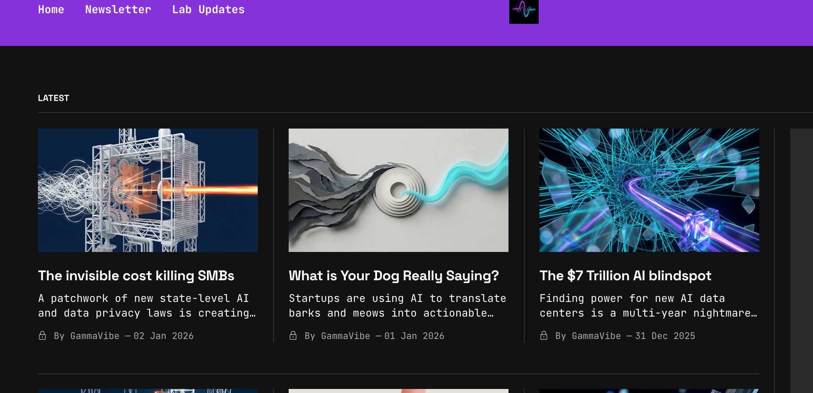
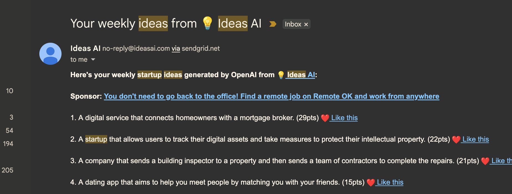
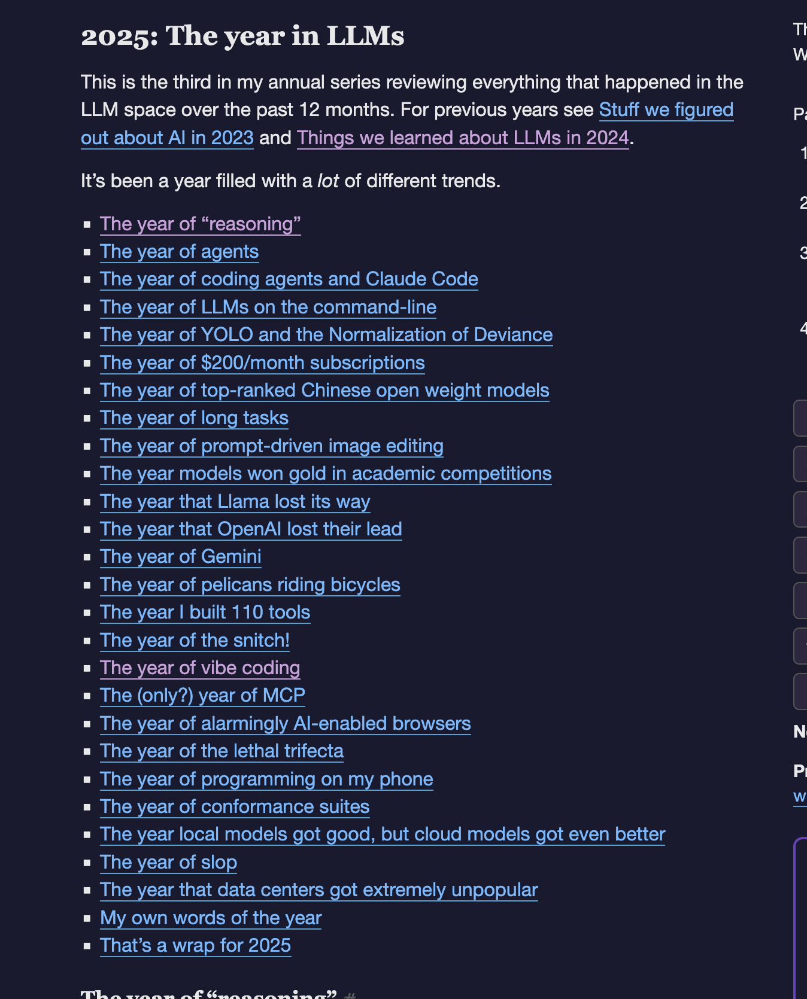
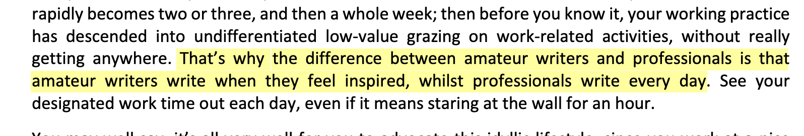
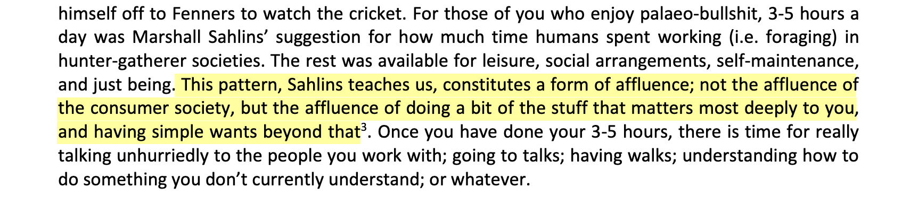
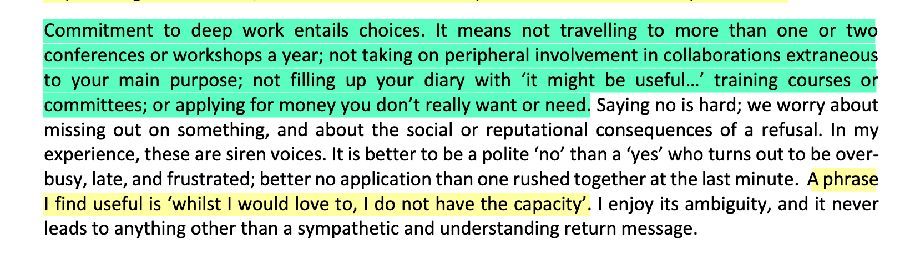
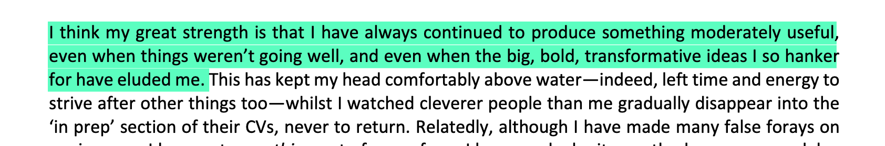
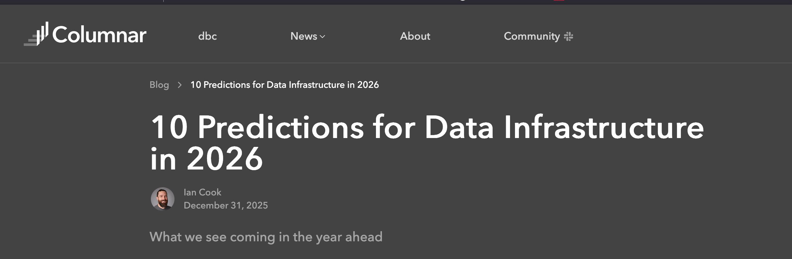
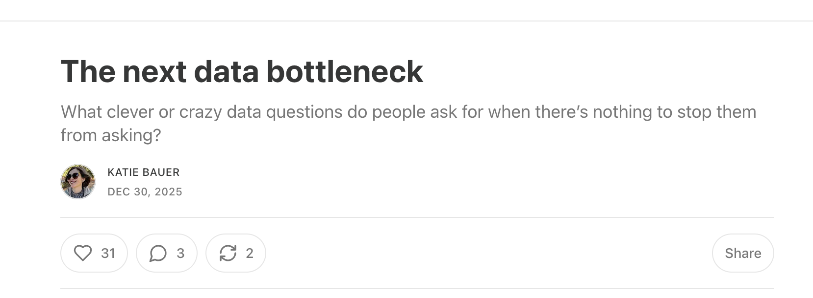
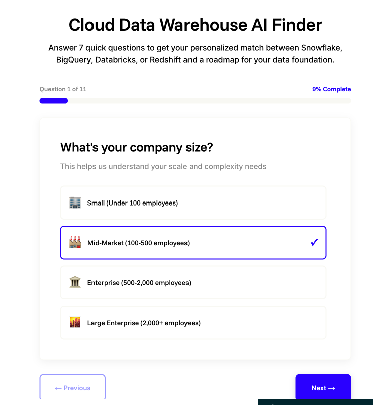

-- Note: No LLM's were harmed during the writing of this post, only my own brain.

There's such an overflow of interesting things out there related to data and software that it's hard to keep track of them all. I've wanted to create a curated newsletter as a way to keep track of the projects I find interesting. Hopefully you can find some inspiration too!

What I found interesting this week:

## Projects

{}

  

 

https://gammavibe.com/newsletter

- The Ex-Googler Mirko Froehlich recently created this automated partly-free newsletter to generate start-up ideas. I subscribed to the free one, but there's a more detailed paid version (5 dollars a month) available.

- This idea of a startup-idea generator is not new, I remember one of the first ChatGPT-powered sites in 2022 that I subscribed to was doing this:  They seemed to have stopped maintaining it, since [it now](https://ideasai.com/) just redirects to the X-profile of the serial AI-entrepeneur that is selling [an e-course](https://readmake.com/).

- But the cool thing about the GammaVibe newsletter is that the creator also goes into [depth of the architecture](https://gammavibe.com/updates/autonomous-startup-generator-architecture/) which explains the tech stack (Python, PydanticAI, Postgresql, SQLModel, Docker) and Gemini. Cool to see such in-depth explanation of the tech, although a repo would have been even better. But I guess that is where the money is made. He even runs the staging environment on a Raspoberry PI, in-house on Docker, whereas the production environment is hosted on DigitalOcean. 
  > Total cost: $77/month now, $167/month later (with EventRegistry paid tier). 

Check it out as an inspiration project!
{}

## Articles

{}

  

 

https://simonwillison.net/2025/Dec/31/the-year-in-llms/#the-year-of-reasoning-

- Simon has an incredibly detailed timeline of "LLM" related events of 2025, and his views/notes on these. Some highlights:
	- It's hard to overstate Simon's impact on technical software writing. He is such a prolific and transparent writer: his blog is a goldmine of insights for software and data engineers alike. And since the rise of LLM's as part of any serious software developer's toolkit, he's been commenting on them. Furthermore, many of his projects are opensource on Github and used by many developers (some reaching more than 10k stars). And his flow of self-documenting projects in [Github Issues](https://github.com/simonw/llm/issues/1300) should be an inspiration to anyone crafting their own projects (private or public). The [inventor of the term "git scraping"](https://simonwillison.net/2020/Oct/9/git-scraping/), for me he the example of a prodigious public coder & blogger who is just too interesting not to follow.
	- Simon built `110` tools in 2025, an explosion of new tools compared to previous years (see [tools by month overview on his own site](https://tools.simonwillison.net/by-month)). From a Green Chef recipe-site for personal use to more technical ones such as a xml-validator and text-diff.  LLM's assisted him greatly. It's great to see the toolmaster (I don't use this term lighly, Simon has created over 170 open-source tools since 2024) at work, sharing his day-to-day experience with tooling. For me, Simon is an example of how to critically apply your software engineering experience to the new AI-assisted code generation frontier. Great to see his output grew this much.
	- His guide ["Here’s how I use LLMs to help me write code"](https://simonwillison.net/2025/Mar/11/using-llms-for-code/) is a good feel for how you can leverage LLM's as a software engineer, creating projects. Although if you've been staying up to date in the "LLM-scene" this year, you will probably already recognize most of it.
	- Another interesting one I saw is the pricing on ChatGPT plus. Most of the popular LLM's and IDE's have a monthly starter tier from around 20 dollars/month. Apparently this was a "snap decision" based on user input:
	> ChatGPT Plus’s original $20/month price turned out to be a snap decision by [Nick Turley based on a Google Form poll on Discord](https://simonwillison.net/2025/Aug/12/nick-turley/). That price point has stuck firmly ever since.
	- According to Simon, 2025 [was not a good year for the open-source Meta Lama model](https://simonwillison.net/2025/Dec/31/the-year-in-llms/#the-year-that-llama-lost-its-way): 
		> "It’s not clear if there are any future Llama releases in the pipeline or if they’ve moved away from open weight model releases to focus on other things."
	- [MCP's are a fad?](https://simonwillison.net/2025/Dec/31/the-year-in-llms/#the-only-year-of-mcp)
		> "The reason I think MCP may be a one-year wonder is the stratospheric growth of coding agents. It appears that the best possible tool for any situation is Bash—if your agent can run arbitrary shell commands, it can do anything that can be done by typing commands into a terminal."
		- Here I don't fully agree. I think that clearly scoped and gated API-wrappers (MCPs) can definitely be helpful as a kind-of-plugin for the local development, if not for autonomous agents. I've been using the [Neon MCP](https://neon.com/docs/ai/neon-mcp-server) extensively in my personal-projects and it really accelerates the debugging proces in my IDE. Now the question will remain as we explicitly program more sophisticated agents in projects, if the MCP in IDE/cli tool will remain as useful. Although I have not tried to call MCP from an agent up til now, so unsure how useful that is. But for now I don't see a reason for MCP to disappear.
		- Sidenote: I didn't know that "MCP" as a concept [has been donated by Anthropic to the Linux Foundation and its childfund Agentic AI Foundation.](https://www.anthropic.com/news/donating-the-model-context-protocol-and-establishing-of-the-agentic-ai-foundation). Will this ensure MCP is here to stay?
	- [Simon has left local-LLM's for the lack of tool calling](https://simonwillison.net/2025/Dec/31/the-year-in-llms/#the-year-local-models-got-good-but-cloud-models-got-even-better):
		> "I have yet to try a local model that handles Bash tool calls reliably enough for me to trust that model to operate a coding agent on my device." 
		- I feel this pain too. I've tried some local models using Ollama on my Macbook Pro, but the IDE-optimized workflow of Cursor/AntiGravity and likes is just too good. And the local models will probably always lack behind cutting edge features, or have hardware limitations. I don't see self-hosted/local models being used in any serious capacity by data engineers in 2026, unless their client/company forces them to.
	- [Did Simon invent the term "AI slop"?](https://simonwillison.net/2025/Dec/31/the-year-in-llms/#the-year-of-slop)
	- [On efficiency and Jevon's Paradox for AI](https://simonwillison.net/2025/Dec/31/the-year-in-llms/#the-year-that-data-centers-got-extremely-unpopular):
		> "AI labs continue to find new efficiencies to help serve increased quality of models using less energy per token, but the impact of that is classic [Jevons paradox](https://en.wikipedia.org/wiki/Jevons_paradox)—as tokens get cheaper we find more intense ways to use them, like spending $200/month on millions of tokens to run coding agents."
	- Another goodie: [Simon builds scrapers from his phone](https://simonwillison.net/2025/Jul/17/vibe-scraping/).
		> "So, to recap: I was able to scrape a website (without even a view source too), turn the resulting JSON data into a mobile-friendly website, add an ICS export feature and deploy the results to a static hosting platform (GitHub Pages) working entirely on my phone."
	- Last bit, [I like how Simon adds quotes from social-media as a mini blog-post as seen here](https://simonwillison.net/2025/Oct/2/nadia-eghbal/) (and references them later in other posts).
	- There's too many interesting observations on this post, so I'll leave it at that. Follow Simon!
	

{}

{}
 https://www.danielnettle.org.uk/wp-content/uploads/2017/09/Staying-in-the-game.pdf
- I came across this blog post from a Professor and cognitive science researcher and author of multiple books and scientific papers over the last 25+ years: [Daniel Nettle](https://www.danielnettle.eu/) and thought it was insightful to see how a professional researcher views his own craft for a scientist in a lifelong commitment for advancing his field. Other than being well-written, it contains some good insights:
- On writing every day instead of when inspiration hits. Something I have as a goal for the coming month:
	
- On the division of work and doing things that matter to YOU.
	
- On limiting your commitments:
	
- Maintaining a steady, useful pace over trying to go big. While it might be a tad self-deprecating, I think it's hopeful for all of us:
	
- I like this final quote:
  > "The mind is like the immune system; to function properly it needs to be constantly challenged by data." So go out there and analyze some! 

{}

{}
 https://columnar.tech/blog/2026-predictions/
- Can't have a new-years post without predictions for the new year. In this one [Columnar](https://columnar.tech/) (the group that is building inter-database connectivity using the Arrow format as the connectivity layer gives some interesting predictions. Mostly focused on the boons of Apache Arrow and the Iceberg open table format, but also mentions some interesting players in the scene:
	- [Greybeam](https://www.greybeam.ai/) - For managed DuckDB clusters. Targets a hybrid Snowflake + managed duckdb solution.
	- [GizmoData](https://gizmodata.com/) - A custom distributed SQL Engine capable of working with [trillions of rows](https://gizmodata.com/blog/gizmoedge-one-trillion-row-challenge). 
	- Query Kafka streams with SQL using one of the many [Query.Farm duck-db extensions](https://query.farm/).
{}

{}
 https://wrongbutuseful.substack.com/p/the-next-data-bottleneck
- Katie Bauer (Head of Data for Hex) shares her view on what user's really query analytics agents (chatbots) after (presumably) having insights to the actual query logs. Not grand strategy. Not data-driven storytelling. Just simple data-retrieval. Probably what a dashboard could've answered.
	> "People _are_ asking more questions and a wider variety of functional roles are asking them to boot. The query stream for an analytics chatbot is a tantalizing dataset. What clever or crazy data questions do people ask for when there’s nothing to stop them from asking?"
	
	>  "It turns out it’s mostly “can you pull XYZ data for me?”

	> "When these people suddenly find themselves with unimpeded access to data, why are they just asking questions that could be answered with, well, a dashboard? Where are all the important business questions they’ve supposedly been blocked from asking up until this point?"
- I would like to see this dataset, I can't imagine that there's no one asking more insightful questions than "what was revenue yesterday for widget_a in North America." Like a agentic Jamie from the Joe Rogan Experience.  

{}

## Other

{}

  

 

https://aztela.com/tools/best-data-warehouse-calculator

 - I love this recommender for selecting a Data Warehouse for your business by [Aztela](https://aztela.com/), a Slovenian data boutique consultancy.
	- The recommender asks a few questions on company size cloud etc, and recommends a data warehouse. Options seem to be BigQuery, Databricks, Snowflake, and Synapse(?) doesn't seem to have RedShift or Fabric interestingly enough.
	- It has a big "Lovable" vibe to it, and the idea is great. Hope to implement a similar thing soon.
{}

That's all for now, hope it was useful. Feel free to leave a comment (sign-in with Github account first) and till next time!
