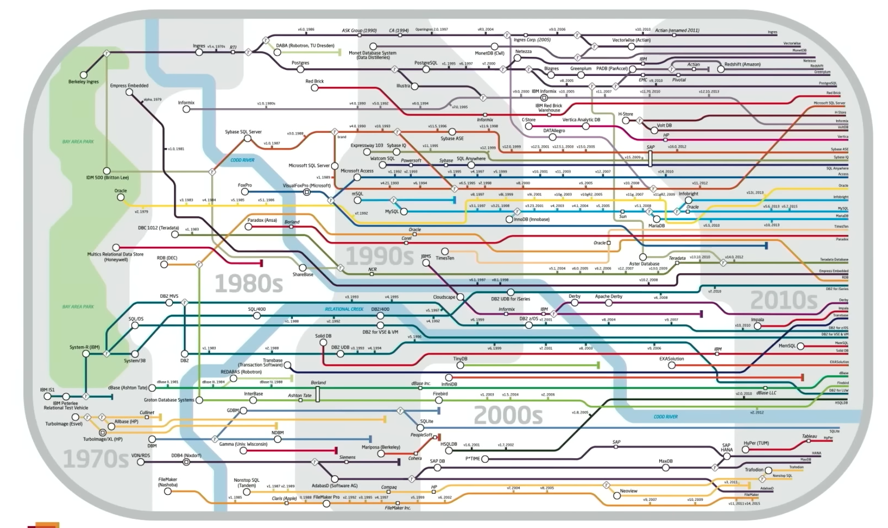
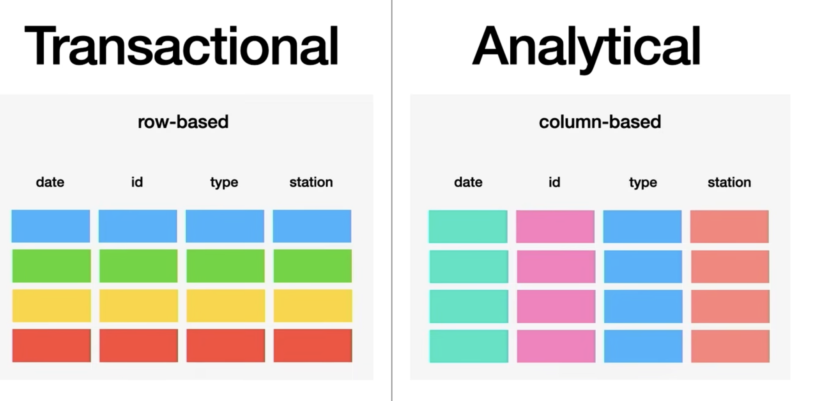
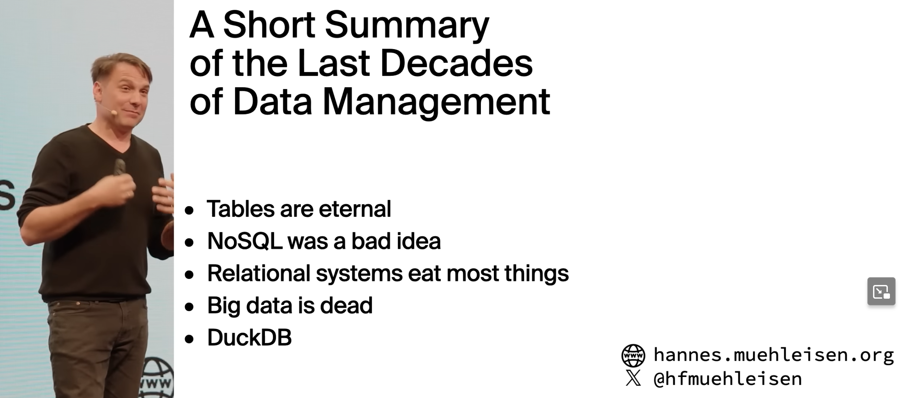
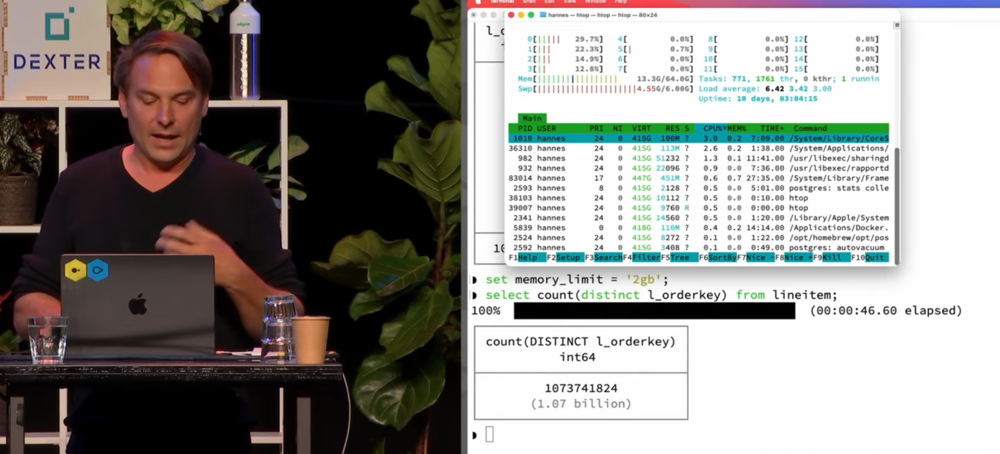
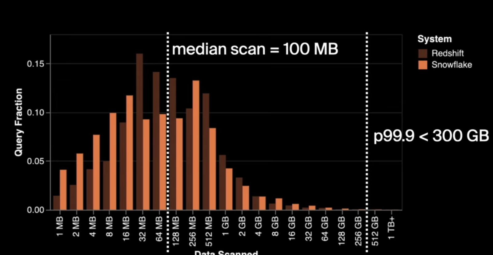
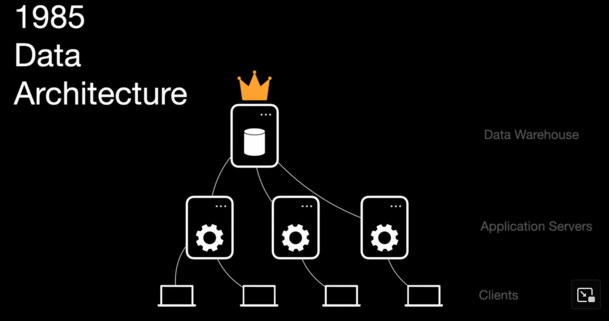
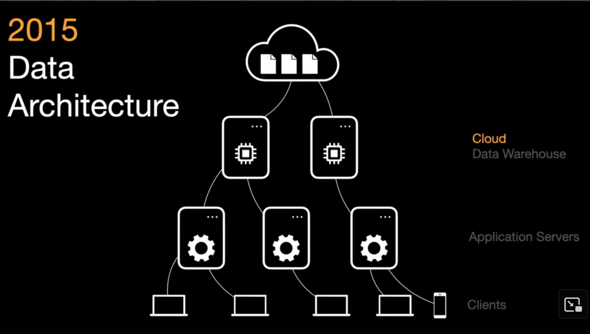
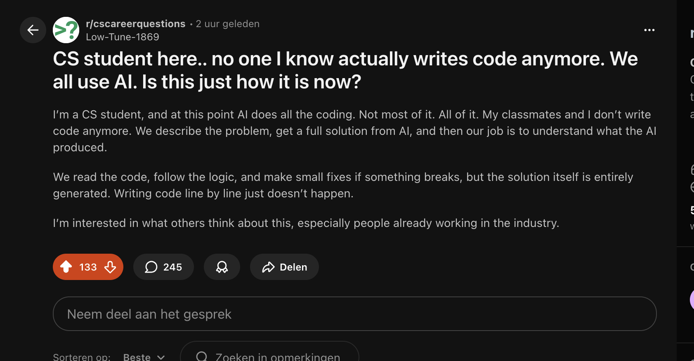
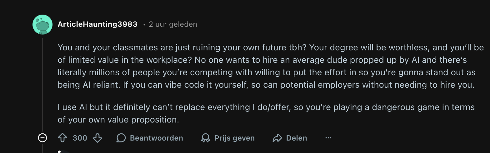

Another week, another `select *`! Let's dive in.

## Projects

{}


 

After my [last weekly blog](https://lasse.be/posts/week-edition-1/) on GammaVibe (the Startup-idea-generator-as-a-newsletter-service), its creator Mirko has added [a new YT video-walkthrough of the architecture](https://gammavibe.com/updates/video-walkthrough-inside-the-gammavibe-architecture/). In this video he goes into the details of the setup that extracts news from the [EventRegistry'](https://eventregistry.org/) news-APIs and goes through a rigorous chain of events that bundles this information using AI agents into, well, the [daily newsletter](https://gammavibe.com/newsletter/). Impressive to see all the different stages, and very helpful as a target-architecture, thanks Mirko!. I was heavily inspired by it to create my own "news-ingestion service", which I will introduce later this year.

{}

# Videos

I have been watching some of the [DuckDB Labs CEO's](https://github.com/duckdb/duckdb) excellent (although older) talks on YouTube this week. I've actually met [Hannes Mühleisen](https://hannes.muehleisen.org/) when he came to visit to one of our knowledge sharing events at Xebia in Amsterdam when I worked there. A very friendly, witty and smart guy with an [impressive track record at Berlin and Amsterdam universities and research institutes](https://www.cwi.nl/en/people/hannes-muehleisen/) (similarly incubated at Amsterdam's research institute Centrum Wiskunde & Informatica, CWI, [as another fellow you might know](https://gvanrossum.github.io/bio.html)) .

Starting first as a researcher of database architectures, and since last year a [Professor of Data Engineering](https://www.cwi.nl/en/news/hannes-m%C3%BChleisen-appointed-as-professor-at-radboud-university/) (I didn't even know that was a thing), while also juggling such details as leading a [startup](https://duckdblabs.com/) with his [PhD student-turned-co-founder Mark Raasveldt](https://mytherin.github.io/) that has taken the data-world by storm, it being one of the most [explosively growing open-source databases](https://duckdb.org/2025/10/09/benchmark-results-14-lts) in the world. Duckdb in turn [spawned a whole company](https://motherduck.com/blog/hello-world/) , both of which employ some of my former Xebia colleagues now. I'm proud that we have a Netherlands-based founder with such a large contribution to the data engineering/analysis work-field in these jingoistic times. Keep up the good work Professor!

Now onto the talks I watched:

{}


 

In this talk, Hannes goes over the history of information systems (databases), it's a real fun talk that demonstrates his ability to make a walk through "dry" subjects as IT systems history engaging (well for me at least, although I might be biased). I think it's a must-watch for DE's (and anyone working with databases) new to the game, since it's a condensed history of our working-field and the different types of databases, although its end is slightly tilted towards vendor-speak (duckdb-can-do-all-of-this-for-you).

- I especially like this "subway-map" style visual of the evolution of RDBMS systems over time, which I had never seen before.
      - Genealogy of Relational Database Management Systems (1970s - 2010s)

- And I like this graphical representation of Analytical vs Transactional data systems as seen from the aspect of the data.  The colors basically indicate the grouping of the data on-disk (or wherever it lives), either in rows-groups or in column-groups, and this little change introduces all kinds of technical challenges that the OLAP/OLTP architectures have to solve.

Some quotes I liked:

> "NoSQL was a really bad idea, because relational systems will be inevitable if you make data systems."
 

> "If your problem can be reduced to a two-column table, then you can use a relational database." So according to Hannes, no need for separate graph, vector, document, time-series optimized databases if we can just do it in duckdb.

 
{}

{}


 

Basically the talk boils down to this quote by Hannes: "What you can do on a single machine is *insane*" (on the power of single-node compute nowadays).

The second talk (similarly free on YouTube) is more recent, and starts as an attack on the established database vendors (Oracle) and their price-gouging ways. Hannes argues during the talk that the old way of the world where the database vendor is effectively "holding your data hostage" are over, and due to the explosive growth of the capabilities of "small" compute has overgrown the requirements of data storage (e.g. the size of data that *most* companies store *has not* grown as much compared to the previous years, in contrast to the price of compute, storage and networking, which *has* radically maybe even exponentially reduced over the last decade. This means that it shouldn't actually make sense to be paying the same prices for databases as in the years before, and you probably don't even need the most powerful state-of-the-art distributed systems for it either.

Which is basically [duckdb's](https://github.com/duckdb) slogan: "You don't have big data, so stop paying for it". During the talk Hannes demoes an aggregation query, (`distinct` values in a field) over a dataset of 256GB, with a **billion** rows, on a machine with only 2GBs of memory. So the dataset is bigger than memory and would have to spill on disk normally. It completes within one minute(**!**). Just shows the impressive results of their optimized in-memory database (duckdb) on less than impressive hardware by current standards.

Some other interesting things in the talk:

- According to Snowflake and Redshift, the median data scanned in a query is only 100MB. A figure which seems to come from [this Fivetran blog post from September 2024](https://www.fivetran.com/blog/how-do-people-use-snowflake-and-redshift) where the author states that the "did the analysis for this post using DuckDB, and it can scan the entire 11 GB Snowflake query sample on my Mac Studio in a few seconds.". How's that for the power of small data. Which further cements his point that most companies are not dealing in "big data" (or at least not actively querying it).
    

Other stuff: the evolution of data architecture according to Hannes:

- 1985: "Clients didn't have much to say."
    
- 2015: "Didn't change a whole lot, just in the Cloud."
    
- 2025: "Storage and metadata is an afterthought and the client is the "empowered user. [...] "

Some quotes I liked:

> "Data that you create locally stays on your device. Transformations run on your device. But we keep cohesion with commoditized storage (s3) and metadata (iceberg) to keep data from your local devices in sync across devices, but without a centralized datawarehouse."
 
 
> "Google created a business model by combining commodity hardware and distributed compute": (MapReduce + Hadoop)."
 
 
> "Client usecases: duckdb on lambda, on application servers. Duckdb on satellites, comms is expensive so process locally."

It's a great, fun talk on the power of commodity hardware in 2025 (or 2026), but instead of going with the Hadoop route of connecting all this commodity hardware together in a complex distributed system of nodes and orchestrators (introduced as Hadoop in 2003), Hannes is arguing the point of going to the *other route* of just running it wherever you have compute on a single machine (could be in the browser, could be mobile phone, could be in an edge device). As long as that your data is not *big*, which it rarely is for most usecases. If you go by the popular saying of *as long as it fits on a laptop, it's not big data*, then duckdb just stretched that axiom a *BILLION* rows further.

Somewhat curiously, but also expected, we have [Motherduck](https://motherduck.com/docs/concepts/architecture-and-capabilities/) pointing out that if you do actually need distributed cloud compute (which is ironically the opposite of Hannes' *original* single-machine propaganda), you can get best of both worlds with their services. For a long time I thought it was counterintuitive: why mix local and external data sources with a shared compute layer, seems like a recipe for trouble. But given the popularity of both duckdb and motherduck, I think it's not a fad at all and might prove a worthy competitor to SF and dbx. However, I also foresee a lot of headscratching by DE's/AE's wondering which dbt table they actually queried.. the local one or the cloud one. But then again, LLM's don't have heads to scratch. Yet.

{}

## Articles

{}

I stumbled across [this Reddit thread](https://www.reddit.com/r/cscareerquestions/comments/1qian6p/cs_student_here_no_one_i_know_actually_writes/) and think it's an interesting insight into what the future might hold for CS students. Will CS grads still really need to code to provide business value? Will high-level languages go like the way of assembly? And will software engineering transition into an all-day long guessing game to [figure out if your brilliant intern is deceiving you](https://www.anthropic.com/research/alignment-faking)? Will a new upperclass arise that *manages* the models while the rest of us drink from their fountains, or did that already happen?  

Anyways, it feels that Reddit's opinion is that this is *a big mistake* and students are making themselves unemployable. Perhaps. Or perhaps it will go the way of the sage wisdom of the 70s of "You can't bring a calculator everywhere you go you know." We actually *could* and we actually *did* and we actually *will* keep bringing our calculators everywhere we go and [look at them non-stop for up to 10 hours a day](https://www.mastermindbehavior.com/post/average-screen-time-statistics), thank you very much.

{}

Other stuff:

- [Have you tried a text box - by Benn Stancil](https://benn.substack.com/p/have-you-tried-a-text-box?utm_source=tldrdata#footnote-1-183276617) - As usual, Benn raises interesting points. What if, instead of trying to "hardcode business decisions", we just handed the LLM's the real, raw context of an organization in voicenotes and let it derive the insights, perhaps these models are already smarter we could dream of? How would we even know?

- [Where AI is headed in 2026 - Foundation Capital](https://foundationcapital.com/where-ai-is-headed-in-2026/) - A quote from the predictions: "Today, most AI interfaces wait for you to ask. But the best employees don’t work that way: they observe the situation, propose a solution, and ask for sign-off.".

- [Column Storage for the AI Era](https://sympathetic.ink/2025/12/11/Column-Storage-for-the-AI-era.html) - Parquet's origins elegantly explained by the PMC Chair. To be honest, I never had any idea of how a [Apache Project Management Committee](https://www.apache.org/dev/pmc.html) worked, let alone the one for our beloved king of formats, Apache Parquet. But the king is under siege, as kings often are. Will they be overtaken? Or will they adapt and keep their throne in the agentic-era?

- <https://adocomplete.com/advent-of-claude-2025/> - The best cheatsheet for Claude Code I've seen to date.
 

That's all, till the next one!
